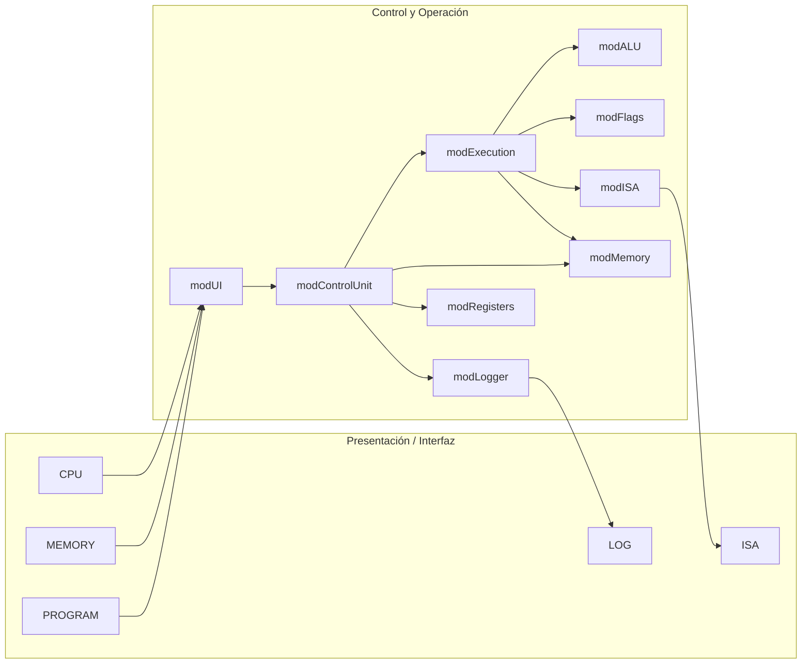
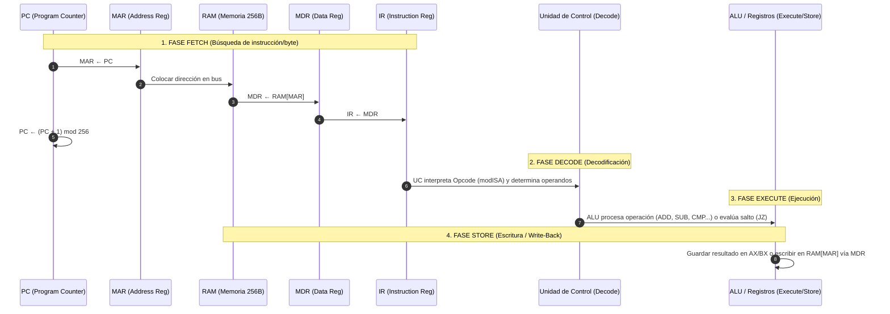

# Simulador de CPU von Neumann / x86 de 8 bits

Simulador interactivo y visual de CPU con arquitectura von Neumann / x86 de 8 bits y Memoria Principal, desarrollado en **Microsoft Excel + VBA (`.xlsm`)** para la materia **Arquitectura de Computadoras (SIS-131)** de la Universidad Católica Boliviana "San Pablo".

**Repositorio:** [AHS-Hernandez/parcial1-SIS131](https://github.com/AHS-Hernandez/parcial1-SIS131)  
**Tablero de Proyecto:** [Backlog · parcial1-SIS131](https://github.com/users/AHS-Hernandez/projects/3)  
**Responsable:** Adriana Hernandez (adriana.hernandez@ucb.edu.bo)

---

## 📋 Propósito del Simulador

El propósito del simulador es modelar y visualizar en tiempo real el funcionamiento interno del hardware y el ciclo completo de instrucción (**Fetch → Decode → Execute → Store**) de un procesador de 8 bits. Permite inspeccionar paso a paso el movimiento de datos entre registros, la memoria RAM y la ALU, facilitando la comprensión del flujo de ejecución a nivel de micro-operaciones de máquina.

---

## 🚀 Guía de Instalación y Manual de Usuario

### 1. Requisitos e Instalación
1. **Requisitos de Software**: Microsoft Excel 2016 o superior (Windows / macOS) con soporte para macros VBA.
2. **Abrir el Ejecutable**: Descargar y abrir el archivo [`SimuladorCPU.xlsm`](SimuladorCPU.xlsm) ubicado en la raíz del repositorio.
3. **Habilitar Macros**: Al abrir el libro, hacer clic en la barra amarilla superior en **"Habilitar contenido"** o **"Habilitar macros"** para permitir la ejecución de los controles VBA.

---

### 2. Manual de Uso de los Controles (Hoja CPU)

| Botón / Control | Función y Comportamiento |
|---|---|
| **`LOAD PROGRAM`** | Lee el código fuente ensamblador escrito en la pestaña `PROGRAM`, lo ensambla a bytes hexadecimales y lo carga en el Segmento de Código de la RAM (`00h`–`7Fh`), reiniciando el `PC` a `00h`. |
| **`STEP`** | Avanza **una micro-operación** a la vez. Resalta con color el componente activo (fase, camino de datos o celda RAM) y actualiza los paneles de registros y banderas. |
| **`RUN`** | Inicia la ejecución secuencial automática continua a través del bucle FSM sin congelar la interfaz de Excel. |
| **`PAUSE`** | Detiene la ejecución automática de `RUN` en el sub-paso actual, permitiendo continuar manualmente en modo `STEP`. |
| **`RESET`** | Restablece los registros (`PC`, `IR`, `MAR`, `MDR`, `AX`, `BX`) y banderas (`ZF`, `CF`, `SF`) a cero, vuelve la fase a `FETCH` y limpia el log. **Mantiene intacta la memoria RAM** para permitir reejecuciones. |
| **Retardo (`rngDelay`)** | Permite ajustar la velocidad de ejecución del modo `RUN` en milisegundos (por ejemplo, `50 ms` o `200 ms`) para observar la animación gráfica. |

---

### 3. Descripción de los Paneles e Interfaz Gráfica

1. **Panel CPU (`Hoja CPU`)**:
   - **Camino de Datos**: Flecha dinámica que señala la transferencia activa entre `PC → MAR`, `MAR → RAM`, `RAM → MDR` y `MDR → IR`.
   - **Panel de Registros**: Muestra los valores actuales en formato Hexadecimal (`00h`–`FFh`).
   - **Panel de Banderas**: Indicadores `1` / `0` de `ZF`, `CF` y `SF`.
   - **Fase y Micro-op Activa**: Muestra el nombre exacto del paso del reloj (ej. `FETCH: MAR ← PC`).
2. **Matriz de Memoria (`Hoja MEMORY`)**:
   - Grilla 16×16 que representa los 256 bytes de la RAM.
   - Resalta en **naranja** la celda actualmente leída/escrita y en **verde** la dirección apuntada por `MAR`.
   - Permite alternar la visualización entre formatos **HEX**, **BIN** y **DEC/Mnemónico**.
3. **Log de Micro-operaciones (`Hoja LOG`)**:
   - Registra una fila por cada sub-paso con marca de tiempo, fase, micro-operación, registros y banderas.

---

## 🏛️ Arquitectura del Sistema

El sistema se compone de **6 hojas de Excel** (interfaz de usuario) y **9 módulos VBA** desacoplados en tres capas funcionales: presentación, control/operación y modelo de datos.

### 📊 Hojas de Excel
- **CPU**: Panel principal con registros (`PC`, `IR`, `MAR`, `MDR`, `AX`, `BX`), banderas (`ZF`, `CF`, `SF`), estado, fase activa, instrucción actual y botones de control (`STEP`, `RUN`, `PAUSE`, `RESET`, `LOAD PROGRAM`).
- **MEMORY**: Grilla de 16×16 celdas (256 bytes, `00h`–`FFh`) con colores de zona (Código: `00h`–`7Fh`, Datos: `80h`–`FFh`) y selector de formato (**HEX**, **BIN**, **DEC/Mnemónico**).
- **PROGRAM**: Formulario de carga de código ensamblador (una instrucción por fila).
- **LOG**: Registro cronológico de micro-operaciones ejecutadas.
- **ISA**: Tabla de referencia con la especificación completa de opcodes y formato de instrucciones.
- **README**: Guía de uso rápido integrada en el libro de cálculo.

### 💾 Modelo de Datos
- **RAM**: 256 celdas de 8 bits (`0` a `255`), accesibles exclusivamente mediante `ReadMem(address)` y `WriteMem(address, value)`.
- **Registros**: `PC` (00h–FFh), `IR` (8 bits), `MAR` (00h–FFh), `MDR` (8 bits), `AX` (acumulador), `BX` (base).
- **Banderas**: `ZF` (Zero), `CF` (Carry/Acarreo), `SF` (Sign/Signo en complemento a 2, bit 7).

---

## 🗺️ Mapa de Memoria, Registros, Banderas e ISA Completa

### 1. Mapa de Memoria Principal (RAM)
- **Rango Total**: `00h` a `FFh` (256 bytes contiguos).
- **Segmentación Lógica**:
  - `00h` – `7Fh` (128 bytes): **Segmento de Código** (zona de carga de instrucciones).
  - `80h` – `EFh` (112 bytes): **Segmento de Datos** (variables, arreglos y almacenamiento).
  - `F0h` – `FFh` (16 bytes): **Zona de Control y Pila**.

### 2. Registros de la CPU (8 bits)
- **`PC` (Program Counter)**: Puntero de 8 bits que almacena la dirección de memoria de la siguiente instrucción o byte por procesar.
- **`IR` (Instruction Register)**: Registro de 8 bits que contiene el código de operación (Opcode) en ejecución.
- **`MAR` (Memory Address Register)**: Registro de dirección conectado a las líneas de bus para especificar la celda de RAM activa.
- **`MDR` / `MBR` (Memory Data Register)**: Registro búfer que almacena el byte recién leído o por escribir en la RAM.
- **`AX` (Acumulador)**: Registro de propósito general de 8 bits para cómputo aritmético-lógico principal.
- **`BX` (Registro Base)**: Registro de propósito general de 8 bits para operaciones auxiliares y operandos secundarios.

### 3. Registro de Estado (Banderas / Flags)
- **`ZF` (Zero Flag)**: Se activa en `1` si el resultado de la última operación de la ALU fue igual a cero (`00h`).
- **`CF` (Carry Flag)**: Se activa en `1` si ocurrió desbordamiento o acarreo sin signo en operaciones aritméticas.
- **`SF` (Sign Flag)**: Refleja el bit más significativo (bit 7, MSB) del resultado. Si es `1`, el valor es negativo en **complemento a 2** (rango `-128` a `127`).

### 4. Tabla Completa del Conjunto de Instrucciones (ISA)

| Mnemónico / Sintaxis | Opcode | Bytes | Operandos | Acción / Operación | Banderas Afectadas |
|---|---|---:|---|---|---|
| `MOV AX, imm` | 10h | 2 | Inmediato | AX ← imm | No cambian |
| `MOV BX, imm` | 11h | 2 | Inmediato | BX ← imm | No cambian |
| `MOV AX, BX` | 12h | 1 | Registro | AX ← BX | No cambian |
| `MOV BX, AX` | 13h | 1 | Registro | BX ← AX | No cambian |
| `LOAD AX, [dir]` | 20h | 2 | Dirección | AX ← RAM[dir] vía MAR y MDR | No cambian |
| `LOAD BX, [dir]` | 21h | 2 | Dirección | BX ← RAM[dir] vía MAR y MDR | No cambian |
| `STORE [dir], AX` | 30h | 2 | Dirección | RAM[dir] ← AX vía MAR y MDR | No cambian |
| `STORE [dir], BX` | 31h | 2 | Dirección | RAM[dir] ← BX vía MAR y MDR | No cambian |
| `ADD AX, imm` | 40h | 2 | Inmediato | AX ← AX + imm | ZF, CF, SF |
| `ADD AX, BX` | 41h | 1 | Registro | AX ← AX + BX | ZF, CF, SF |
| `ADD BX, imm` | 42h | 2 | Inmediato | BX ← BX + imm | ZF, CF, SF |
| `ADD BX, AX` | 43h | 1 | Registro | BX ← BX + AX | ZF, CF, SF |
| `SUB AX, imm` | 50h | 2 | Inmediato | AX ← AX − imm | ZF, CF, SF |
| `SUB AX, BX` | 51h | 1 | Registro | AX ← AX − BX | ZF, CF, SF |
| `SUB BX, imm` | 52h | 2 | Inmediato | BX ← BX − imm | ZF, CF, SF |
| `SUB BX, AX` | 53h | 1 | Registro | BX ← BX − AX | ZF, CF, SF |
| `INC AX` | 60h | 1 | Registro | AX ← AX + 1 | ZF, CF, SF |
| `INC BX` | 61h | 1 | Registro | BX ← BX + 1 | ZF, CF, SF |
| `DEC AX` | 62h | 1 | Registro | AX ← AX − 1 | ZF, CF, SF |
| `DEC BX` | 63h | 1 | Registro | BX ← BX − 1 | ZF, CF, SF |
| `CMP AX, imm` | 70h | 2 | Inmediato | Evalúa AX − imm (AX no cambia) | ZF, CF, SF |
| `CMP AX, BX` | 71h | 1 | Registro | Evalúa AX − BX (AX no cambia) | ZF, CF, SF |
| `CMP BX, imm` | 72h | 2 | Inmediato | Evalúa BX − imm (BX no cambia) | ZF, CF, SF |
| `CMP BX, AX` | 73h | 1 | Registro | Evalúa BX − AX (BX no cambia) | ZF, CF, SF |
| `JMP dir` | 80h | 2 | Dirección | PC ← dir (Salto incondicional) | No cambian |
| `JZ dir` | 90h | 2 | Dirección | PC ← dir si ZF = 1 | No cambian |
| `JNZ dir` | A0h | 2 | Dirección | PC ← dir si ZF = 0 | No cambian |
| `HLT` | FFh | 1 | Ninguno | Detiene la CPU (Estado HALTED) | No cambian |

---

## 🧩 Responsabilidad de los Módulos VBA

| Módulo | Capa | Responsabilidad Principal |
|---|---|---|
| [`modMemory`](src/modMemory.bas) | Datos | Administra la matriz RAM de 256 bytes y provee primitivas de lectura (`ReadMem`), escritura (`WriteMem`), vaciado (`ClearMem`) y carga en bloque (`LoadBlock`). |
| [`modRegisters`](src/modRegisters.bas) | Datos | Mantiene el estado de los 6 registros de la CPU (`PC`, `IR`, `MAR`, `MDR`, `AX`, `BX`), su reinicio (`ResetRegisters`) y el incremento circular de `PC`. |
| [`modFlags`](src/modFlags.bas) | Datos | Controla y actualiza el estado de las 3 banderas (`ZF`, `CF`, `SF`), calculando el signo en complemento a 2 y el acarreo de 8 bits. |
| [`modISA`](src/modISA.bas) | Datos | Define la tabla de codificación de instrucciones, asignación de opcodes, modos de direccionamiento y funciones de decodificación (`DecodeByte`, `MnemonicToOpcode`). |
| [`modALU`](src/modALU.bas) | Operación | Ejecuta cálculos aritméticos y lógicos de 8 bits (`ADD`, `SUB`, `INC`, `DEC`, `CMP`, `AND`, `OR`, `XOR`, `NOT`) y desencadena la actualización atómica de banderas. |
| [`modExecution`](src/modExecution.bas) | Operación | Despacha la ejecución de la instrucción actual decodificada, aplica saltos condicionales (`JZ`, `JNZ`, `JMP`) y efectúa la fase Store hacia registros o RAM. |
| [`modControlUnit`](src/modControlUnit.bas) | Control | Controla la Máquina de Estados Finita (FSM), la secuencia del ciclo de reloj (`FETCH`, `DECODE`, `EXECUTE`, `STORE`) y gestiona las rutinas de los botones (`STEP`, `RUN`, `PAUSE`, `RESET`, `LOAD`). |
| [`modUI`](src/modUI.bas) | Presentación | Refresca la interfaz de Excel tras cada micro-operación, aplicando resaltado visual de colores a la fase activa, el camino de datos y la celda de memoria en uso. |
| [`modLogger`](src/modLogger.bas) | Presentación | Escribe cada sub-paso de reloj en la hoja `LOG` con el detalle de registros, banderas y micro-operaciones realizadas. |
| [`modUtils`](src/modUtils.bas) | Auxiliar | Provee funciones puras de conversión (Hex, Bin, Dec), formateo de cadenas y validaciones de rangos de 8 bits. |

---

## 🔄 Diagramas del Ciclo y Camino de Datos

### 1. Diagrama de la Arquitectura por Capas

### 2. Ciclo de Instrucción y Flujo de Datos (`PC → MAR → RAM → MDR → IR`)

---

## 📁 Estructura del Repositorio

| Ruta | Contenido |
|---|---|
| `SimuladorCPU.xlsm` | Libro de Microsoft Excel con macros VBA (ejecutable principal). |
| [`src/`](src/) | Módulos de código VBA exportados en formato texto para versionado con Git. |
| [`docs/ANALISIS.md`](docs/ANALISIS.md) | Análisis de requerimientos, consigna académica y especificación de la rúbrica. |
| [`docs/ARQUITECTURA.md`](docs/ARQUITECTURA.md) | Especificación detallada de la arquitectura, modelo de datos y diseño por capas. |
| [`docs/ISA.md`](docs/ISA.md) | Tabla completa del conjunto de instrucciones (ISA) de 8 bits y opcodes. |
| [`docs/PROGRAMA_DEMO.md`](docs/PROGRAMA_DEMO.md) | Programa demostrativo (multiplicación por sumas sucesivas) y traza de ejecución. |
| [`docs/PRUEBAS.md`](docs/PRUEBAS.md) | Reporte de pruebas unitarias e integrales en VBA. |
