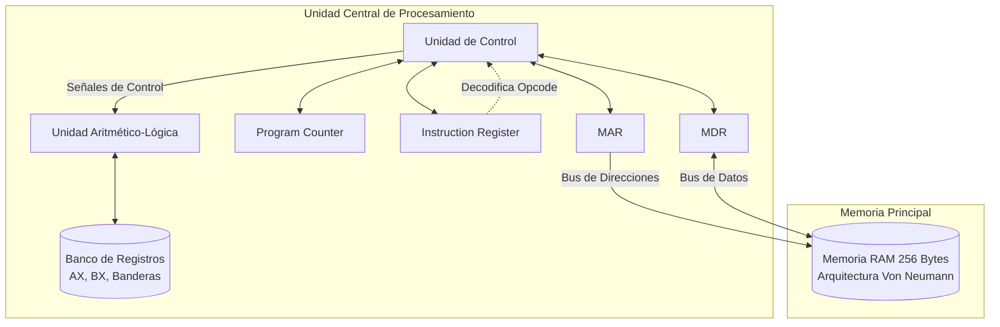

# Simulador de Arquitectura CPU 8-Bits


## 📋 Descripción General
Simulador interactivo de arquitectura de CPU de 8 bits desarrollado íntegramente en Microsoft Excel utilizando Visual Basic for Applications (VBA). Esta herramienta educativa permite visualizar el funcionamiento interno de un procesador y su ruta de datos (Datapath) mediante la ejecución paso a paso de instrucciones en lenguaje ensamblador personalizado.

El simulador implementa una **Arquitectura Von Neumann** clásica, donde las instrucciones y los datos comparten el mismo espacio de memoria, facilitando la comprensión del ciclo de máquina básico: *Fetch*, *Decode*, *Execute* y *Store*.

## 📑 Tabla de Contenidos
1. [Introducción](#1-introducción)
2. [Fundamentos Teóricos](#2-fundamentos-teóricos)
3. [Arquitectura del Simulador](#3-arquitectura-del-simulador)
4. [Componentes Implementados (Software)](#4-componentes-implementados-software)
5. [Guía de Uso](#5-guía-de-uso)
6. [Ejemplos Prácticos](#6-ejemplos-prácticos)
7. [Apéndices (ISA Completo)](#7-apéndices)

---

## 1. Introducción

### 1.1 Objetivos del Proyecto
* **Educación Visual:** Proveer una representación gráfica en tiempo real de cómo los datos fluyen a través de los buses internos de una CPU.
* **Comprensión del Ciclo Máquina:** Desglosar la ejecución de un programa en micro-operaciones observables.
* **Gestión de Memoria:** Ilustrar la convivencia de Código y Datos en una memoria unificada (Von Neumann).
* **Accesibilidad:** Utilizar una plataforma universal (Excel) para eliminar la fricción de instalación de entornos complejos.

### 1.2 Características Principales
| Característica | Descripción |
|---|---|
| **Arquitectura** | Von Neumann (Memoria Unificada de 256 bytes) |
| **Palabra / Bus** | 8 bits (Valores `00h` a `FFh`) |
| **Registros ALU** | AX, BX (Propósito general) |
| **Registros Control** | PC, IR, MAR, MDR, Registro Temporal |
| **Banderas (Flags)**| Zero (ZF), Carry (CF), Sign (SF) |
| **Plataforma** | MS Excel + Macros VBA orientadas a eventos |

---

## 2. Fundamentos Teóricos

### 2.1 Unidad de Control (U.C.)
La Unidad de Control actúa como el cerebro del procesador, orquestando las señales.
* **PC (Program Counter):** Apunta a la siguiente dirección de memoria a leer.
* **IR (Instruction Register):** Almacena el *Opcode* de la instrucción que se está decodificando.
* **MAR (Memory Address Register):** Retiene la dirección de memoria a la que la CPU desea acceder.
* **MDR (Memory Data Register):** Actúa como búfer (puente) para los datos que entran o salen de la memoria.



### 2.2 Unidad Aritmético-Lógica (ALU)
Realiza las operaciones matemáticas y lógicas. Actualiza dinámicamente tres banderas fundamentales:
* **ZF (Zero Flag):** Se activa (`1`) si el resultado de la operación es cero. Utilizado por `JZ` y `JNZ`.
* **CF (Carry Flag):** Se activa (`1`) si ocurre desbordamiento (*overflow* de 8 bits, > 255). Utilizado por `JC`.
* **SF (Sign Flag):** Se activa (`1`) si el bit más significativo (MSB) indica un número negativo en complemento a 2.

### 2.3 Arquitectura Von Neumann y Memoria
El sistema cuenta con una matriz de **256 celdas de 1 byte**. En nuestra interfaz visual, la memoria está segmentada lógicamente mediante colores, pero físicamente comparte el mismo bus:
* **Zona de Código (Azul):** `00h` a `7Fh`.
* **Zona de Datos (Naranja):** `80h` a `FFh`.

### 2.4 Ciclo de Instrucción (Fases de Máquina)
El simulador respeta rigurosamente las 4 fases del ciclo máquina para procesar cualquier instrucción. Así es como programamos la transición de estados dentro del código VBA (`modControlUnit.bas`):

```mermaid
flowchart TD
    A((Inicio Ciclo)) --> B[FETCH]
    B --> C{¿La instrucción<br/>requiere un operando<br/>de 2do byte?}
    C -->|No (1 Byte)| D[DECODE]
    C -->|Sí (2 Bytes)| B2[FETCH<br/>del Operando]
    B2 --> D
    D --> E[EXECUTE]
    E --> F{¿Se debe guardar<br/>un resultado?}
    F -->|Sí| G[STORE<br/>Write-back]
    F -->|No| H((Fin Ciclo))
    G --> H
    H --> A
    E -.-> |Si es HLT| Z((Detener CPU))
    
    classDef fase fill:#e1f5fe,stroke:#01579b,stroke-width:2px;
    class B,B2,D,E,G fase;
```

---

## 3. Arquitectura del Simulador

El software está diseñado bajo un modelo Vista-Controlador descentralizado dentro de Excel:

1. **Capa de Presentación (Hojas):**
   * `CPU`: Dashboard principal. Muestra registros, datapath animado y botones de control.
   * `MEMORY`: Visualizador dinámico de RAM. Permite cambiar vistas (HEX / BIN / Ensamblador) con un solo clic gracias a controles nativos Shape. A continuación se detalla cómo programamos esta interactividad visual:
   
   ```mermaid
   sequenceDiagram
       actor Usuario
       participant MEMORY as Hoja MEMORY (UI)
       participant VBA as modUI.bas (VBA)
       participant RAM as Arreglo RAM(0-255)
       
       Usuario->>MEMORY: Clic en botón [DEC/Mnem]
       MEMORY->>VBA: Dispara macro VistaMemDEC()
       VBA->>VBA: Establece estado mVistaMem = VISTA_DEC
       VBA->>RAM: Extrae bytes crudos
       loop Por cada celda (00h a FFh)
           alt Es Zona de Código (00h-7Fh)?
               VBA->>VBA: Llama a DecodeByte(byte)
               VBA-->>MEMORY: Renderiza Mnemónico (Ej: 'MOV')
           else Es Zona de Datos (80h-FFh)?
               VBA-->>MEMORY: Renderiza Decimal (Ej: '12')
           end
       end
       VBA->>MEMORY: Resalta botón [DEC/Mnem] en dorado
   ```

   * `PROGRAM`: Editor de código ensamblador (sintaxis humana) listo para ser compilado/cargado en RAM.
   * `LOG`: Registro histórico detallado de cada micro-operación ejecutada.

2. **Capa de Lógica (Módulos VBA):** La CPU simulada opera bajo un ciclo estricto de 4 fases por instrucción:
   * **FETCH:** Traslada la instrucción de Memoria(PC) -> MAR -> MDR -> IR. Si la instrucción requiere operando, realiza un segundo *Fetch*.
   * **DECODE:** Traduce el byte crudo (ej. `B8h`) a la micro-operación interna.
   * **EXECUTE:** La ALU realiza el trabajo pesado o se resuelven las condiciones de salto.
   * **STORE:** Guarda resultados (Write-back) en los registros o en memoria vía `MDR`.

---

## 4. Componentes Implementados (Software)

El proyecto consta de **~1,200 líneas de código VBA** organizadas meticulosamente:

| Módulo | Descripción Técnica |
|---|---|
| `modUI.bas` | Renderizado, coloreado dinámico, gestión de botones Shape, traductor Hex/Bin/Mnemónico. |
| `modControlUnit.bas` | Ciclo global del reloj, secuenciador de Fases (Fetch, Decode), orquestador principal. |
| `modExecution.bas` | Lógica de la ALU, saltos incondicionales y condicionales (actualización de variables internas). |
| `modISA.bas` | Diccionario de opcodes (Mnemónico ↔ Binario/Hex) y metadatos de las instrucciones (ej. conteo de bytes). |
| `modMemory.bas` | Arreglo unidimensional `RAM(0 to 255)`. Lógica segura de lectura/escritura (ReadMem/WriteMem). |
| `modRegisters.bas` | Variables encapsuladas para `PC`, `MAR`, `MDR`, `IR`, `AX`, `BX` con validaciones de 8 bits (0-255). |
| `modFlags.bas` | Funciones matemáticas para establecer ZF, CF, y SF tras el paso por la ALU. |

---

## 5. Guía de Uso

### 5.1 Configuración Inicial
1. Abrir `SimuladorCPU.xlsm`.
2. **Habilitar Macros** (Requisito estricto, el simulador depende de VBA).
3. (Opcional) Si la interfaz gráfica presenta anomalías, presionar `ALT+F11`, ir a la ventana Inmediato y ejecutar `PulirInterfaz`.

### 5.2 Ciclo de Ejecución Básica
1. Dirigirse a la hoja `PROGRAM` y escribir (o mantener) un código válido.
2. Ir a la hoja `CPU` y hacer clic en el botón verde **LOAD** (Carga la RAM y resetea el PC a 0).
3. Controlar la CPU con:
   * **STEP (Paso a Paso):** Avanza una micro-operación. Ideal para observar el bus de datos en tiempo real.
   * **RUN:** Ejecución continua (delay de 200ms) hasta encontrar la instrucción `HLT`.
   * **PAUSE:** Detiene un `RUN` en progreso.
   * **RESET:** Vacía los registros y regresa el `PC` a 0.

---

## 6. Ejemplos Prácticos

El simulador se entrega con dos rutinas avanzadas precargadas en la hoja `PROGRAM`:

### 6.1 Multiplicación por sumas sucesivas (Loop con JZ)
Demuestra iteración controlada utilizando la bandera Zero (ZF). Calcula 3 x 4 = 12 (`0Ch`).
```assembly
MOV AX, 00h       ; AX = Acumulador
MOV BX, 03h       ; BX = Multiplicador
CMP BX, 00h       ; Validación inicial
JZ 0Dh            ; Si BX=0, fin
ADD AX, 04h       ; AX = AX + Multiplicando
DEC BX            ; BX--
JMP 04h           ; Repetir bucle
STORE [82h], AX   ; Guardar resultado
HLT
```

#### Análisis y Traza de Registros
A continuación se presenta la traza de ejecución de las primeras iteraciones del ciclo máquina, demostrando cómo fluyen los datos por el datapath:

| Paso | Instrucción | Fase Actual | PC | AX | BX | ZF | Comentario / Micro-operación |
|---|---|---|---|---|---|---|---|
| 1 | `MOV AX, 00h` | EXECUTE | `02h` | **`00h`** | `00h` | `0` | Inicializa acumulador AX a 0. |
| 2 | `MOV BX, 03h` | EXECUTE | `04h` | `00h` | **`03h`** | `0` | Inicializa multiplicador BX a 3. |
| 3 | `CMP BX, 00h` | EXECUTE | `06h` | `00h` | `03h` | `0` | Resta interna BX - 0. Resultado > 0. |
| 4 | `JZ 0Dh` | EXECUTE | `08h` | `00h` | `03h` | `0` | No salta (ZF=0). PC sigue secuencial. |
| 5 | `ADD AX, 04h` | EXECUTE | `0Ah` | **`04h`** | `03h` | `0` | 1ra iteración: AX = AX + 4. |
| 6 | `DEC BX` | EXECUTE | `0Bh` | `04h` | **`02h`** | `0` | 1ra iteración: Multiplicador decrece a 2. |
| 7 | `JMP 04h` | EXECUTE | **`04h`** | `04h` | `02h` | `0` | Salto incondicional al inicio del bucle. |
| 8 | `CMP BX, 00h` | EXECUTE | `06h` | `04h` | `02h` | `0` | Comprueba BX (2) contra 0. |
| ... | *...* | *...* | *...* | *...* | *...* | *...* | *... Continúa el bucle ...* |
| 19| `CMP BX, 00h` | EXECUTE | `06h` | `0Ch` | `00h` | **`1`** | Tras la última iteración, BX llega a 0. ¡ZF=1! |
| 20| `JZ 0Dh` | EXECUTE | **`0Dh`** | `0Ch` | `00h` | `1` | Condición cumplida. PC salta fuera del bucle. |
| 21| `STORE [82], AX`| STORE | `0Fh` | `0Ch` | `00h` | `1` | El resultado final (12 / `0Ch`) se va a RAM. |
| 22| `HLT` | EXECUTE | `10h` | `0Ch` | `00h` | `1` | CPU Detenida exitosamente. |

### 6.2 Serie de Fibonacci por Hardware (Overflow CF)
Demuestra el uso de variables en memoria y el control de desbordamiento de 8 bits mediante la bandera de acarreo y el salto condicional `JC`. Calcula la serie y almacena de forma segura el último valor válido (233).
```assembly
MOV AX, 00h
STORE [80h], AX   ; A = 0
MOV AX, 01h
STORE [81h], AX   ; B = 1
LOAD AX, [80h]    ; <-- INICIO DEL BUCLE
LOAD BX, [81h]
ADD AX, BX        ; F_new = A + B
JC 18h            ; SALTO POR DESBORDAMIENTO (>255)
STORE [82h], AX   ; Guarda ultimo F_new válido
STORE [81h], AX   ; B_new = F_new
MOV AX, BX        
STORE [80h], AX   ; A_new = B_old
JMP 08h           ; VOLVER AL BUCLE
HLT               ; <-- FIN DE EJECUCIÓN (Dirección 18h)
```

---

## 7. Apéndices

### Apéndice A: Conjunto Completo de Instrucciones (ISA)
*El simulador utiliza Opcodes estandarizados internamente.*

| Instrucción | Opcode | Bytes | Descripción Abreviada | Modifica Flags |
|---|---|---|---|---|
| `MOV AX, imm` | `10h` | 2 | Carga inmediato en AX | - |
| `MOV AX, BX`  | `12h` | 1 | Copia de Registro a Registro | - |
| `LOAD AX, [dir]`| `20h` | 2 | Lectura Directa de RAM a AX | - |
| `STORE [dir], AX`| `30h` | 2 | Escritura Directa de AX a RAM | - |
| `ADD AX, BX`  | `41h` | 1 | Suma Aritmética | ZF, CF, SF |
| `INC AX`      | `50h` | 1 | Incremento en 1 | ZF, CF, SF |
| `DEC AX`      | `60h` | 1 | Decremento en 1 | ZF, CF, SF |
| `CMP AX, BX`  | `72h` | 1 | Resta simulada (solo altera Flags) | ZF, CF, SF |
| `JMP dir`     | `80h` | 2 | Salto Incondicional | - |
| `JZ dir`      | `90h` | 2 | Jump if Zero (`ZF=1`) | - |
| `JC dir`      | `98h` | 2 | Jump if Carry (`CF=1`) | - |
| `AND AX, BX`  | `B1h` | 1 | AND lógico bit a bit | ZF, SF |
| `NOT AX`      | `F0h` | 1 | Complemento a 1 de AX | ZF, SF |
| `HLT`         | `F4h` | 1 | Detiene la CPU (Halt) | - |

*(Ver hoja `ISA` en el libro de Excel para los opcodes en notación binaria completa).*

---
Desarrollado para la materia SIS131. Implementado bajo las directrices de la Arquitectura Von Neumann.
