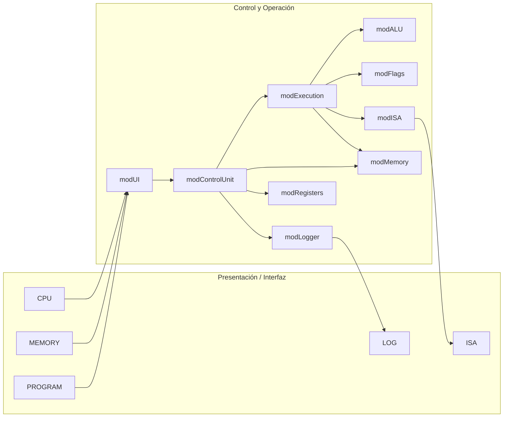
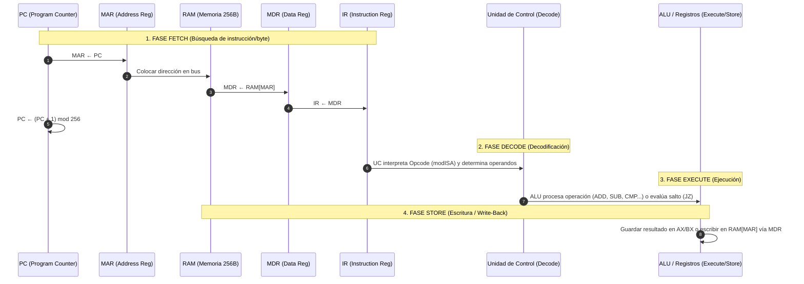

# Simulador de CPU von Neumann / x86 de 8 bits

Simulador interactivo y visual de CPU con arquitectura von Neumann / x86 de 8 bits y Memoria Principal, desarrollado en **Microsoft Excel + VBA (`.xlsm`)** para la materia **Arquitectura de Computadoras (SIS-131)** de la Universidad Católica Boliviana "San Pablo".

**Repositorio:** [AHS-Hernandez/parcial1-SIS131](https://github.com/AHS-Hernandez/parcial1-SIS131)  
**Tablero de Proyecto:** [Backlog · parcial1-SIS131](https://github.com/users/AHS-Hernandez/projects/3)  
**Responsable:** Adriana Hernandez (adriana.hernandez@ucb.edu.bo)

---

## 📋 Propósito del Simulador

El propósito del simulador es modelar y visualizar en tiempo real el funcionamiento interno del hardware y el ciclo completo de instrucción (**Fetch → Decode → Execute → Store**) de un procesador de 8 bits. Permite inspeccionar paso a paso el movimiento de datos entre registros, la memoria RAM y la ALU, facilitando la comprensión del flujo de ejecución a nivel de micro-operaciones de máquina.

---

## 🏛️ Arquitectura del Sistema

El sistema se compone de **6 hojas de Excel** (interfaz de usuario) y **9 módulos VBA** desacoplados en tres capas funcionales: presentación, control/operación y modelo de datos.

### 📊 Hojas de Excel
- **CPU**: Panel principal con registros (`PC`, `IR`, `MAR`, `MDR`, `AX`, `BX`), banderas (`ZF`, `CF`, `SF`), estado, fase activa, instrucción actual y botones de control (`STEP`, `RUN`, `PAUSE`, `RESET`, `LOAD PROGRAM`).
- **MEMORY**: Grilla de 16×16 celdas (256 bytes, `00h`–`FFh`) con colores de zona (Código: `00h`–`7Fh`, Datos: `80h`–`FFh`) y selector de formato (**HEX**, **BIN**, **DEC/Mnemónico**).
- **PROGRAM**: Formulario de carga de código ensamblador (una instrucción por fila).
- **LOG**: Registro cronológico de micro-operaciones ejecutadas.
- **ISA**: Tabla de referencia con la especificación completa de opcodes y formato de instrucciones.
- **README**: Guía de uso rápido integrada en el libro de cálculo.

### 💾 Modelo de Datos
- **RAM**: 256 celdas de 8 bits (`0` a `255`), accesibles exclusivamente mediante `ReadMem(address)` y `WriteMem(address, value)`.
- **Registros**: `PC` (00h–FFh), `IR` (8 bits), `MAR` (00h–FFh), `MDR` (8 bits), `AX` (acumulador), `BX` (base).
- **Banderas**: `ZF` (Zero), `CF` (Carry/Acarreo), `SF` (Sign/Signo en complemento a 2, bit 7).

---

## 🧩 Responsabilidad de los Módulos VBA

| Módulo | Capa | Responsabilidad Principal |
|---|---|---|
| [`modMemory`](src/modMemory.bas) | Datos | Administra la matriz RAM de 256 bytes y provee primitivas de lectura (`ReadMem`), escritura (`WriteMem`), vaciado (`ClearMem`) y carga en bloque (`LoadBlock`). |
| [`modRegisters`](src/modRegisters.bas) | Datos | Mantiene el estado de los 6 registros de la CPU (`PC`, `IR`, `MAR`, `MDR`, `AX`, `BX`), su reinicio (`ResetRegisters`) y el incremento circular de `PC`. |
| [`modFlags`](src/modFlags.bas) | Datos | Controla y actualiza el estado de las 3 banderas (`ZF`, `CF`, `SF`), calculando el signo en complemento a 2 y el acarreo de 8 bits. |
| [`modISA`](src/modISA.bas) | Datos | Define la tabla de codificación de instrucciones, asignación de opcodes, modos de direccionamiento y funciones de decodificación (`DecodeByte`, `MnemonicToOpcode`). |
| [`modALU`](src/modALU.bas) | Operación | Ejecuta cálculos aritméticos y lógicos de 8 bits (`ADD`, `SUB`, `INC`, `DEC`, `CMP`, `AND`, `OR`, `XOR`, `NOT`) y desencadena la actualización atómica de banderas. |
| [`modExecution`](src/modExecution.bas) | Operación | Despacha la ejecución de la instrucción actual decodificada, aplica saltos condicionales (`JZ`, `JNZ`, `JMP`) y efectúa la fase Store hacia registros o RAM. |
| [`modControlUnit`](src/modControlUnit.bas) | Control | Controla la Máquina de Estados Finita (FSM), la secuencia del ciclo de reloj (`FETCH`, `DECODE`, `EXECUTE`, `STORE`) y gestiona las rutinas de los botones (`STEP`, `RUN`, `PAUSE`, `RESET`, `LOAD`). |
| [`modUI`](src/modUI.bas) | Presentación | Refresca la interfaz de Excel tras cada micro-operación, aplicando resaltado visual de colores a la fase activa, el camino de datos y la celda de memoria en uso. |
| [`modLogger`](src/modLogger.bas) | Presentación | Escribe cada sub-paso de reloj en la hoja `LOG` con el detalle de registros, banderas y micro-operaciones realizadas. |
| [`modUtils`](src/modUtils.bas) | Auxiliar | Provee funciones puras de conversión (Hex, Bin, Dec), formateo de cadenas y validaciones de rangos de 8 bits. |

---

## 🔄 Diagramas del Ciclo y Camino de Datos

### 1. Diagrama de la Arquitectura por Capas

### 2. Ciclo de Instrucción y Flujo de Datos (`PC → MAR → RAM → MDR → IR`)

---

## 📁 Estructura del Repositorio

| Ruta | Contenido |
|---|---|
| `SimuladorCPU.xlsm` | Libro de Microsoft Excel con macros VBA (ejecutable principal). |
| [`src/`](src/) | Módulos de código VBA exportados en formato texto para versionado con Git. |
| [`docs/ANALISIS.md`](docs/ANALISIS.md) | Análisis de requerimientos, consigna académica y especificación de la rúbrica. |
| [`docs/ARQUITECTURA.md`](docs/ARQUITECTURA.md) | Especificación detallada de la arquitectura, modelo de datos y diseño por capas. |
| [`docs/ISA.md`](docs/ISA.md) | Tabla completa del conjunto de instrucciones (ISA) de 8 bits y opcodes. |
| [`docs/PROGRAMA_DEMO.md`](docs/PROGRAMA_DEMO.md) | Programa demostrativo (multiplicación por sumas sucesivas) y traza de ejecución. |
| [`docs/PRUEBAS.md`](docs/PRUEBAS.md) | Reporte de pruebas unitarias e integrales en VBA. |
