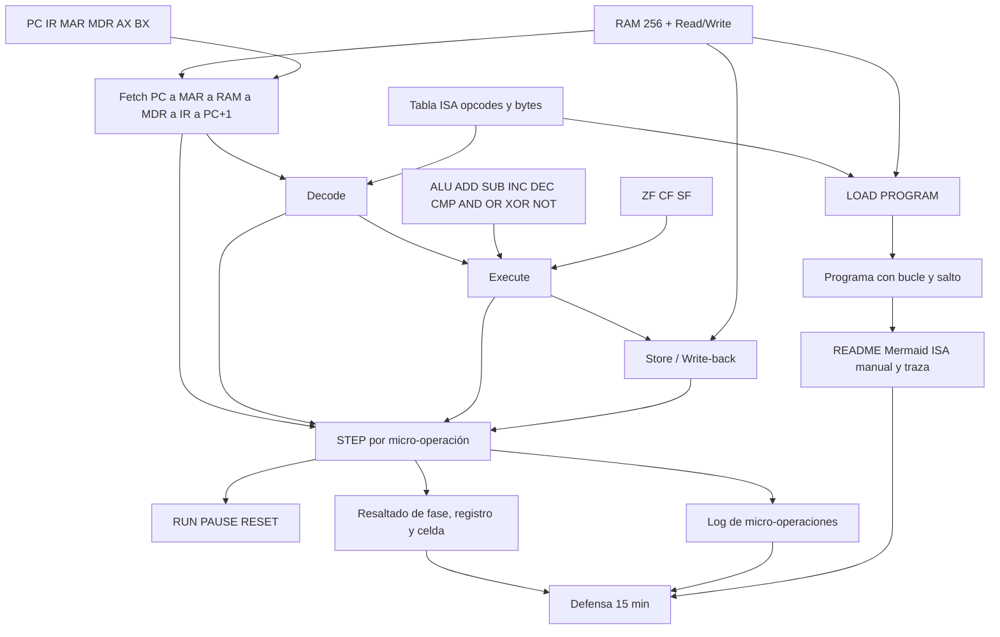

# Análisis de la consigna — Parcial 1

Simulador de CPU von Neumann / x86 de 8 bits y memoria principal.  
Materia: Arquitectura de Computadoras (SIS-131). Docente: Ing. Paulo César Loayza Carrasco.  
Ponderación: 100 puntos. Plataforma elegida: **Microsoft Excel + VBA (`.xlsm`)**.

Este documento sirve para no perder ni un requisito y para construir directo al nivel **Excelente (90–100)**. No es el README final ni el diseño de la ISA definitiva: marca qué exige la consigna, qué suma, qué baja la nota y en qué orden conviene construir.

## Cómo usarlo

| Si vas a… | Lee solo |
|---|---|
| Saber si algo es obligatorio | [Inventario](#1-inventario-de-lo-obligatorio) |
| Decidir si un detalle “alcanza” o hace falta más | [Qué da puntos](#2-qué-da-puntos) |
| Evitar una anulación o una banda baja | [Qué resta o anula](#3-qué-resta-o-anula) |
| Programar sin trabarte por dependencias | [Dependencias](#4-dependencias-entre-componentes) |
| Cerrar una decisión que la consigna no fija | [Decisiones](#5-decisiones-de-diseño) |
| Escribir el ciclo paso a paso | [Micro-operaciones](#6-ciclo-de-instrucción-al-detalle) |
| Preparar la defensa de 15 minutos | [Defensa](#10-riesgos-y-guion-de-la-defensa) |
| Revisar antes de cerrar el repo | [Lista Excelente](#11-lista-de-control-para-excelente) |

---

## 0. Tablero de mando

**Meta de nota:** Excelente, 90 a 100. Meta interna de trabajo: **96–100**, para absorber un descuido de 4 puntos y seguir en la banda alta.

**Entrega (única forma válida):**

1. Enlace al repositorio: https://github.com/AHS-Hernandez/parcial1-SIS131
2. Enlace al tablero: https://github.com/users/AHS-Hernandez/projects/3

No se entrega `.zip` ni el `.xlsm` suelto en la plataforma académica. La evaluación se hace sobre esos dos enlaces.

**Cierre improrrogable:** domingo 29 de septiembre de 2026, 23:59, hora de Santa Cruz. Cualquier commit, pull request o cambio de tarjeta **después** de esa hora anula la entrega. GitHub guarda la hora en UTC y a veces la muestra así: las 20:00 de Santa Cruz del 29 ya son las 00:00 UTC del 30. Por eso el último movimiento real queda como muy tarde el **domingo 29 a las 18:00** (hora Santa Cruz), y el sábado 26 se reserva como cierre cómodo. Después de ese momento no se toca el repositorio ni el tablero.

**Defensa:** 15 minutos, individual, obligatoria. Indicio de copia: 0 y remisión institucional.

| # | Criterio | Pts | Banda Excelente | Lo que el docente tiene que ver |
|---|---|---:|---|---|
| 1 | Funcionalidad y ciclo de CPU | 30 | 27–30 | Fetch, Decode, Execute y Store reales, con MAR y MDR. STEP y RUN impecables. HLT y saltos precisos, también en bordes de banderas. |
| 2 | Memoria y registros | 15 | 14–15 | Mapa 00h–FFh perfecto. Código y datos separados a la vista. PC, IR, MAR, MDR, AX, BX y ZF, CF, SF alineados con la ALU. |
| 3 | Interfaz, usabilidad y dinamismo | 15 | 14–15 | Se ve qué componente está activo. Log cronológico. Controles claros. |
| 4 | Kanban y Git | 15 | 14–15 | Tarjetas con criterio de aceptación. Commits atómicos y semánticos durante el desarrollo, no un commit final gigante. |
| 5 | README | 10 | 10 | Mermaid, tabla ISA completa, manual de uso y traza del programa de prueba. |
| 6 | Defensa oral | 15 | 14–15 | 10 + 5 minutos. Explica, demuestra y modifica código o memoria en vivo. |

Si cada criterio cae en su mínimo Excelente, la nota es **27+14+14+14+10+14 = 93**. El techo es 100.

---

## 1. Inventario de lo obligatorio

Cada fila es un requisito de la consigna. Si no está, no es “un extra”: falta parte del enunciado.

### 1.1 Entrega y forma de trabajo

| ID | Requisito | Dónde dice |
|---|---|---|
| E-01 | Una sola plataforma. Aquí: Excel con macros VBA, archivo `.xlsm`. | §2.1 opción A |
| E-02 | Código, scripts y documentación Markdown dentro del repositorio. | §3 |
| E-03 | Tablero GitHub Projects con columnas **Backlog, To Do, In Progress, In Review / Testing, Done**. | §3 |
| E-04 | Cada issue con criterios de aceptación (memoria, decodificador, animación, etc.). | §3 |
| E-05 | Historial continuo de commits semánticos: `feat:`, `fix:`, `docs:`, `refactor:`. | §3 |
| E-06 | README profesional en Markdown con los cuatro bloques de la rúbrica. | §3 y criterio 5 |
| E-07 | Entrega solo con los dos enlaces, antes del cierre. | §3 y §6 |
| E-08 | Defensa oral de 15 minutos. | §4 |

### 1.2 Memoria

| ID | Requisito |
|---|---|
| M-01 | 256 celdas contiguas de 8 bits, direcciones **00h (0)** a **FFh (255)**. |
| M-02 | Una celda = 1 byte. |
| M-03 | Grilla en la hoja (el ejemplo de la consigna es **16×16**) para inspeccionar cada dirección. |
| M-04 | Cada celda se puede ver en **hexadecimal, binario y decimal/mnemónico**. |
| M-05 | Segmento de código y segmento de datos distinguibles a simple vista. |
| M-06 | Primitivas `Read(address)` y `Write(address, value)`. |

### 1.3 CPU, registros y ALU

| ID | Componente | Qué debe cumplir |
|---|---|---|
| C-01 | PC | 8 bits. Dirección de la **siguiente** instrucción. |
| C-02 | IR | Opcode y operandos de la instrucción en curso. |
| C-03 | MAR | Dirección que se lee o escribe en RAM. |
| C-04 | MDR (también llamado MBR) | Dato recién leído o que está por escribirse. |
| C-05 | AX y BX | Propósito general, 8 bits. AX hace de acumulador. |
| C-06 | ZF | 1 si el último resultado de la ALU fue 0. |
| C-07 | CF | 1 si hubo acarreo o desbordamiento sin signo. |
| C-08 | SF | Copia el bit 7 del resultado: 1 si el valor es negativo en **complemento a 2**. |
| C-09 | ALU | ADD, SUB, INC, DEC y también AND, OR, XOR, NOT y CMP. |

La consigna fija complemento a 2 para el signo. No es una decisión libre: SF solo tiene sentido si el byte se lee como −128…127.

### 1.4 Las cuatro fases, en este orden

| Fase | Secuencia que la consigna escribe |
|---|---|
| Fetch | PC → MAR; RAM[MAR] → MDR; MDR → IR; PC ← PC+1. |
| Decode | La unidad de control lee el opcode en IR, reconoce el modo de direccionamiento y prepara operandos. |
| Execute | La ALU opera, o se resuelve el salto. Se actualizan las banderas cuando la operación es de ALU. |
| Store | El resultado queda en AX o BX, o se escribe MDR → RAM[MAR]. |

El Fetch no puede colapsarse en “leer memoria y ya”. El docente resta si el simulador salta al resultado final sin ese camino.

### 1.5 Controles e interfaz

| ID | Requisito |
|---|---|
| U-01 | **STEP**: una fase o una micro-operación por clic. |
| U-02 | En ese instante se resalta el registro, el bus o la celda que está activa. |
| U-03 | **RUN**: ejecución seguida, con retardo ajustable. |
| U-04 | **PAUSE**, **RESET** y **LOAD PROGRAM** accesibles. |
| U-05 | RESET restaura **registros y PC a cero**. |
| U-06 | Log cronológico de micro-operaciones, del estilo `[Paso 08] FETCH: MAR=0x12, MDR=0x05 → IR=ADD AX, 0x05`. |

### 1.6 ISA mínima y programa

Tiene que ejecutarse, como mínimo, esta sintaxis:

| Grupo | Instrucciones |
|---|---|
| Transferencia | `MOV reg, imm` · `MOV reg, reg` · `LOAD reg, [dir]` · `STORE [dir], reg` |
| Aritmética | `ADD reg, imm/reg` · `SUB reg, imm/reg` · `INC reg` · `DEC reg` · `CMP reg, imm/reg` |
| Control | `JMP dir` · `JZ dir` (salta si ZF=1) · `JNZ dir` (salta si ZF=0) · `HLT` |

`reg` en este diseño es AX o BX. `imm` y `dir` son un byte.

El programa demostrativo es obligatorio y tiene que tener **bucle y bifurcación**. La consigna propone cuatro ejemplos válidos: multiplicación por sumas sucesivas, Fibonacci hasta desborde de 8 bits, factorial, o cuenta regresiva guardando en memoria.

---

## 2. Qué da puntos

La rúbrica no premia “tener algo parecido”. Cada banda describe un fallo concreto. La diferencia entre Bueno y Excelente está en los bordes, el reloj y la presentación, no en agregar funciones que el enunciado no pide.

### 2.1 Funcionalidad — 30 pts

| Banda | Pts | El simulador se comporta así |
|---|---|---|
| Malo | 0–15 | No corre, se traba, o salta al resultado sin las 4 fases. |
| Regular | 16–20 | Hay ciclo, pero se omite MAR o MDR. Fallan saltos o HLT. Solo anda lo simple. |
| Bueno | 21–26 | Las 4 fases operan. Hay aritmética y saltos, con fallos leves de banderas en casos borde. |
| Excelente | 27–30 | El ciclo es fiel. STEP y RUN no fallan. El reloj se detiene exactamente en HLT. Los bordes de ZF, CF y SF salen bien. |

Para los 27–30 no alcanza con que `ADD` “de el número correcto” en pantalla. Hay que poder detenerse en `PC→MAR`, mostrar el byte en MDR, pasarlo a IR, y recién después ejecutar.

### 2.2 Memoria y registros — 15 pts

| Banda | Pts | Qué falta para no estar aquí |
|---|---|---|
| Malo | 0–7 | No hay mapa 00h–FFh, faltan registros, el PC no avanza, no hay IR ni banderas. |
| Regular | 8–10 | Hay 256 bytes, pero faltan MAR o MDR, o las banderas no coinciden con la ALU. |
| Bueno | 11–13 | Mapa correcto en hex y binario. Registros presentes. Alguna instrucción no actualiza banderas. |
| Excelente | 14–15 | Código y datos se distinguen. Los seis registros se ven. ZF, CF y SF quedan sincronizados con **cada** operación de ALU. |

### 2.3 Interfaz — 15 pts

| Banda | Pts | Señal |
|---|---|---|
| Malo | 0–7 | Hoja caótica. No se sabe qué pieza está activa. No hay animación. |
| Regular | 8–10 | Hay botones, pero no se ilumina la fase y no hay log. |
| Bueno | 11–13 | Orden, STEP/RUN/RESET, y resaltado de registros y celdas. |
| Excelente | 14–15 | Se lee como material de clase: flujo en tiempo real, log detallado, botones que no estorban. |

### 2.4 Kanban y Git — 15 pts

| Banda | Pts | Señal |
|---|---|---|
| Malo | 0–7 | Tablero vacío o un solo commit de “entrega final”. |
| Regular | 8–10 | Pocas tarjetas, commits escasos, mensajes como “cambios” o “subiendo”. |
| Bueno | 11–13 | Issues en columnas y commits atómicos con mensaje claro a lo largo de los días. |
| Excelente | 14–15 | Cada tarjeta dice cómo se acepta. El historial es semántico, continuo y se entiende solo. |

Un issue que agrupa varias piezas (layout de CPU, layout de memoria y nombres de rangos, por ejemplo) se cierra con **varios commits chicos**, no con uno enorme. Mismos días, historial más fino.

### 2.5 README — 10 pts

| Banda | Pts | Qué tiene que haber |
|---|---|---|
| Malo | 0–5 | No existe, es copiado o son pocas líneas. Sin opcodes ni manual. |
| Regular | 6–7 | Texto plano, sin diagrama, sin tabla de opcodes o sin recorrido del programa. |
| Bueno | 8–9 | README ordenado, tabla de instrucciones, guía de ejecución y explicación del programa. |
| Excelente | 10 | Diagrama de arquitectura en Mermaid, tabla ISA (opcode, bytes, descripción), manual paso a paso y **traza completa** del programa de prueba. |

Este criterio no admite 14 sobre 15: o está en 10 o ya no es Excelente.

### 2.6 Defensa — 15 pts

| Banda | Pts | Señal |
|---|---|---|
| Malo | 0–7 | Se pasa del tiempo, no explica su código, o hay copia. |
| Regular | 8–10 | Dudas al unir el hardware con las líneas de VBA. |
| Bueno | 11–13 | Cumple el tiempo, demuestra el simulador y responde la mayoría. |
| Excelente | 14–15 | Precisa. Cambia una instrucción o un byte de memoria en vivo y los explica. |

### 2.7 Aritmética de la nota

| Situación | Cálculo | Nota | Banda |
|---|---|---:|---|
| Todo en el piso de Excelente | 27+14+14+14+10+14 | 93 | Excelente |
| Funcionalidad perfecta y el resto en el piso de Excelente | 30+14+14+14+10+14 | 96 | Excelente |
| Todo perfecto | 30+15+15+15+10+15 | 100 | Excelente |
| Funcionalidad se queda en Bueno bajo y lo demás es perfecto | 21+15+15+15+10+15 | 91 | Excelente raspado |
| Saltos o MAR/MDR flojos (Regular) aunque lo demás sea perfecto | 20+15+15+15+10+15 | 90 | Justo Excelente |
| Ciclo a medias y defensa regular | 20+10+10+10+7+10 | 67 | Regular |
| Un solo commit final y simulador incompleto | puede caer bajo 50 | — | Reprobado |

Conclusión práctica: **MAR, MDR, las cuatro fases y los bordes de banderas** valen más que cualquier adorno. Perder el criterio 1 hasta Regular (20) deja la nota en 90 solo si todo lo demás está perfecto, y eso no deja margen.

---

## 3. Qué resta o anula

### 3.1 Anula la entrega o la deja en cero

| Hecho | Efecto |
|---|---|
| Commit, PR o movimiento de tarjeta después del 29/09/2026 23:59 | La consigna dice que **anula la entrega**. |
| Subir `.zip` o el libro fuera de GitHub | Esa vía no se evalúa. |
| No presentarse a la defensa, o evidencia de plagio | 0 en defensa y, si es plagio, 0 del parcial. |
| Tocar el repositorio “para un arreglo de última hora” ya pasada la hora | Mismo efecto que llegar tarde. El arreglo ya no entra. |

### 3.2 Baja de banda, aunque el programa “funcione”

| Hecho | A dónde empuja la nota |
|---|---|
| Calcular ADD directo, sin PC, MAR, MDR e IR | Criterio 1, Malo (0–15). |
| Omitir MAR o MDR | Criterio 1, Regular (16–20). Criterio 2, Regular (8–10). |
| JMP / JZ / JNZ / HLT incorrectos | Criterio 1, Regular (16–20). |
| Banderas mal en 00h, FFh, cero, negativo o acarreo | Criterio 1 se queda en Bueno (21–26). Ahí se pierden hasta 9 puntos. |
| Memoria que no es 00h–FFh, o PC que no cambia | Criterio 2, Malo (0–7). |
| Sin resaltado o sin log | Criterio 3, Regular o Malo. |
| Un commit masivo el último día, o mensajes vagos | Criterio 4, Malo o Regular. |
| README sin Mermaid, sin tabla ISA o sin traza | Criterio 5 cae a 9, 7 o menos. Con 9, el parcial puede seguir en Excelente; con 7, ya no. |
| Pasarse de los 15 minutos o no poder cambiar una instrucción en vivo | Criterio 6, Regular o Malo. |
| Hoja llena de números sueltos, sin jerarquía | Criterio 3. La rúbrica penaliza el exceso de información tanto como la hoja vacía. |

### 3.3 Lo que no resta, y conviene no disfrazarlo de requisito

Caché, pipeline, bus multiplexado, interrupciones y periféricos son materia del **segundo parcial**. Meterlos ahora no suma en esta rúbrica y sí arriesga el tiempo. El código de ahora solo tiene que dejar hueco para enchufarlos después: módulos separados, no una sola macro gigante.

---

## 4. Dependencias entre componentes

Nada de Execute se puede creer hasta que la memoria y los registros responden en los extremos. El orden de abajo es el que evita rehacer pantallas.

| Si esto no existe | No se puede cerrar |
|---|---|
| Read/Write de la RAM | Fetch ni STORE |
| PC, MAR, MDR, IR | Ninguna fase visible |
| Tabla de opcodes | Decode ni LOAD PROGRAM |
| Banderas reales | JZ, JNZ y la rúbrica de ALU |
| STEP de una micro-operación | RUN, el resaltado y el log |
| Programa cargado | La traza del README y los minutos 4–10 de la defensa |

Los nombres que el VBA debe usar desde el primer layout, para no reescribir fórmulas el día de la defensa: `rngPC`, `rngIR`, `rngMAR`, `rngMDR`, `rngAX`, `rngBX`, `rngRAM`, más celdas visibles para ZF, CF y SF.

---

## 5. Decisiones de diseño

La consigna obliga el comportamiento y deja libre la implementación. Estas son las decisiones con las que se apunta a Excelente. La tabla formal de la ISA se vuelca después en la hoja `ISA` y en `docs/ISA.md`; aquí queda el criterio para no contradecirla.

### 5.1 Plataforma

Excel `.xlsm` en la raíz. El VBA se exporta como texto a `src/` para que el historial de Git muestre el código y no solo un binario. Google Sheets queda descartada: mezclar las dos plataformas a mitad de camino no suma puntos.

### 5.2 Ancho y aritmética

Todo valor de registro y de celda es un entero 0…255. Se rechaza cualquier escritura fuera de ese rango.

Para SF y para las restas se interpreta el mismo byte en complemento a 2:

| Byte | Sin signo | Con signo |
|---|---:|---:|
| 00h | 0 | 0 |
| 01h | 1 | 1 |
| 7Fh | 127 | 127 |
| 80h | 128 | −128 |
| FFh | 255 | −1 |

Reglas de banderas, iguales para toda la ALU:

- **ZF = 1** solo si el resultado (el byte que queda, o el que CMP calcula y descarta) es 00h.
- **CF = 1** en ADD/INC si el resultado sin signo no cabe en 8 bits (acarreo del bit 7). En SUB/DEC/CMP, CF = 1 si hay préstamo: el sustraendo sin signo es mayor que el minuendo.
- **SF = 1** si el bit 7 del resultado es 1.
- MOV, LOAD, STORE, JMP, JZ, JNZ y HLT **no tocan** las banderas. Si las tocaran, un `JZ` después de un `MOV` dependería del movimiento y no de la comparación, y eso no se puede defender.

Detalle que van a preguntar: en el 8086 real, `INC` y `DEC` no modifican CF. **En este simulador sí**, porque la consigna mete INC y DEC en la ALU y define CF como acarreo de la ALU. Se dice en voz alta en la defensa para que no parezca un descuido.

CMP hace la resta, actualiza ZF, CF y SF, y **no guarda** el resultado en el registro.

AND, OR y XOR actualizan ZF y SF. Su CF queda en 0: no hay acarreo en una operación bit a bit. NOT invierte los 8 bits, CF = 0, y ZF/SF salen del resultado.

### 5.3 Qué entra en la ISA

El conjunto mínimo de la sección 2.6 no lista AND, OR, XOR ni NOT. La sección 2.3 sí las exige dentro de la ALU. Para no quedar en un hueco el día de la pregunta:

- El módulo ALU las calcula aunque nadie las llame.
- Además se publican como instrucciones. Cuesta poco, cierra la frase de la consigna y deja una instrucción simple para **insertar en vivo** durante la defensa (NOT es la más fácil de mostrar).

### 5.4 Mapa de memoria recomendado

Una sola RAM de 256 bytes compartida por código y datos. No hay segmentos de hardware: la separación es lógica y visual.

| Rango | Uso | En la grilla 16×16 |
|---|---|---|
| 00h–7Fh | Código. LOAD PROGRAM escribe aquí y pone PC = 00h. | Filas 0 a 7 |
| 80h–FFh | Datos. Variables del programa demostrativo. | Filas 8 a 15 |

128 bytes de código alcanzan para el programa de ejemplo y para una instrucción agregada en vivo. El color de la zona de código y el de la zona de datos tienen que distinguirse sin leer la dirección.

### 5.5 Codificación recomendada

Una instrucción ocupa 1 byte si no lleva dato, o 2 bytes si lleva inmediato o dirección. El segundo byte se trae con otro Fetch (de nuevo MAR, MDR y PC+1). El IR muestra el opcode y, cuando existe, el operando.

Familias por nibble alto, para explicarlas en 20 segundos: `1` mueve, `2` carga, `3` guarda, `4` suma, `5` resta, `6` inc/dec, `7` compara, `8` salta, `9` salta si cero, `A` salta si no cero, `B` and, `C` or, `D` xor, `E` not, `F` parada.

| Mnemónico | Opcode | Bytes | Acción breve |
|---|---|---:|---|
| `MOV AX, imm` | 10h | 2 | AX ← imm |
| `MOV BX, imm` | 11h | 2 | BX ← imm |
| `MOV AX, BX` | 12h | 1 | AX ← BX |
| `MOV BX, AX` | 13h | 1 | BX ← AX |
| `LOAD AX, [dir]` | 20h | 2 | AX ← RAM[dir] |
| `LOAD BX, [dir]` | 21h | 2 | BX ← RAM[dir] |
| `STORE [dir], AX` | 30h | 2 | RAM[dir] ← AX |
| `STORE [dir], BX` | 31h | 2 | RAM[dir] ← BX |
| `ADD AX, imm` | 40h | 2 | AX ← AX+imm |
| `ADD AX, BX` | 41h | 1 | AX ← AX+BX |
| `ADD BX, imm` | 42h | 2 | BX ← BX+imm |
| `ADD BX, AX` | 43h | 1 | BX ← BX+AX |
| `SUB AX, imm` | 50h | 2 | AX ← AX−imm |
| `SUB AX, BX` | 51h | 1 | AX ← AX−BX |
| `SUB BX, imm` | 52h | 2 | BX ← BX−imm |
| `SUB BX, AX` | 53h | 1 | BX ← BX−AX |
| `INC AX` | 60h | 1 | AX ← AX+1 |
| `INC BX` | 61h | 1 | BX ← BX+1 |
| `DEC AX` | 62h | 1 | AX ← AX−1 |
| `DEC BX` | 63h | 1 | BX ← BX−1 |
| `CMP AX, imm` | 70h | 2 | Flags de AX−imm, AX no cambia |
| `CMP AX, BX` | 71h | 1 | Flags de AX−BX, AX no cambia |
| `CMP BX, imm` | 72h | 2 | Flags de BX−imm, BX no cambia |
| `CMP BX, AX` | 73h | 1 | Flags de BX−AX, BX no cambia |
| `JMP dir` | 80h | 2 | PC ← dir |
| `JZ dir` | 90h | 2 | PC ← dir si ZF=1 |
| `JNZ dir` | A0h | 2 | PC ← dir si ZF=0 |
| `AND AX, imm` | B0h | 2 | AX ← AX AND imm |
| `AND AX, BX` | B1h | 1 | AX ← AX AND BX |
| `OR AX, imm` | C0h | 2 | AX ← AX OR imm |
| `OR AX, BX` | C1h | 1 | AX ← AX OR BX |
| `XOR AX, imm` | D0h | 2 | AX ← AX XOR imm |
| `XOR AX, BX` | D1h | 1 | AX ← AX XOR BX |
| `NOT AX` | E0h | 1 | AX ← NOT AX |
| `NOT BX` | E1h | 1 | BX ← NOT BX |
| `HLT` | FFh | 1 | Estado = HALTED. El reloj no sigue. |

AND/OR/XOR/NOT sobre BX con inmediato siguen el mismo patrón (B2h, C2h, D2h) si hace falta en la defensa. No son parte del mínimo si el tiempo aprieta; las versiones con AX sí cierran la ALU.

En un salto, el PC ya avanzó al leer el opcode y la dirección. Si el salto **no** se toma, el PC sigue después de esa dirección. Si se toma, se reemplaza el PC con `dir` y el byte siguiente no se ejecuta.

### 5.6 RESET

La frase literal es: restaurar registros y PC a cero. Las banderas son el registro de estado, así que también vuelven a 0. La fase vuelve a Fetch y el estado de la CPU queda listo.

**La RAM no se borra.** Así, en la defensa, RESET + STEP vuelve a recorrer el mismo programa sin cargar otra vez. Borrar la memoria obliga a usar LOAD PROGRAM entre cada explicación y gasta los minutos 4–10. Si se quiere una demostración desde fábrica, eso es otra acción, no el RESET de la consigna.

### 5.7 Programa demostrativo

| Candidato | ALU | Banderas | Memoria | Salto | Facilidad para narrarlo | Decisión |
|---|---|---|---|---|---|---|
| Multiplicación por sumas sucesivas | Alta | ZF al terminar el conteo | Guarda el producto | Bucle JNZ | Alta: “sumo BX, N veces” | **Elegido** |
| Fibonacci hasta desborde | Alta | CF al pasar de FFh | Puede guardar la serie | Bucle | Media: hay que explicar dos registros | Reserva |
| Factorial | Alta | Desborda muy pronto (6! ya no cabe) | Poca | Bucle | Baja: el resultado útil se acaba en 5 | No |
| Cuenta regresiva | Baja | ZF al llegar a 0 | Guardado condicional | JZ | Alta, pero muestra poca ALU | No |

El producto que se va a defender: dado N en memoria de datos y un valor en BX, AX acumula `N * BX` y el resultado se guarda con STORE. Tiene bucle, JZ o JNZ, ALU y memoria. La traza número por número se escribe cuando el programa esté codificado; este análisis solo fija **cuál** y **por qué**.

---

## 6. Ciclo de instrucción al detalle

Estados de la CPU: `RUNNING`, `PAUSED`, `HALTED`, `RESET`.  
Fases: `FETCH`, `DECODE`, `EXECUTE`, `STORE`.

`RUNNING` es el default de RUN. STEP puede usarse también en pausa: avanza una micro-operación y se queda. `HALTED` ignora STEP y RUN hasta un RESET. PAUSE no tira el contenido de los registros: solo deja de pedir el siguiente paso.

### 6.1 Fetch, partido para que se vea

Para el opcode, y otra vez igual para el operando si la instrucción mide 2 bytes:

| Paso | Micro-operación | Qué se ilumina |
|---|---|---|
| F1 | MAR ← PC | PC y MAR |
| F2 | MDR ← RAM[MAR] | MAR, la celda y MDR |
| F3 | IR recibe ese byte (opcode u operando) | MDR e IR |
| F4 | PC ← (PC + 1) módulo 256 | PC |

F4 usa módulo 256: después de FFh viene 00h. Hay que decirlo, porque es el borde de un contador de 8 bits.

### 6.2 Decode

| Paso | Qué ocurre |
|---|---|
| D1 | Se separa el opcode de los bytes ya tomados. |
| D2 | Se reconoce la familia y el modo: inmediato, registro o directo `[dir]`. |
| D3 | Si falta el operando, se vuelve a Fetch para el segundo byte y se regresa a Decode. |
| D4 | Queda preparado qué registro se lee, qué celda y qué operación de ALU. Un opcode desconocido no sigue: log de error y CPU en `HALTED`. |

### 6.3 Execute y Store, por familia

| Familia | Execute | Store | Banderas |
|---|---|---|---|
| MOV reg, imm/reg | El valor nuevo queda en un temporal | Se copia al registro destino | No cambian |
| LOAD reg, [dir] | MAR ← dir; MDR ← RAM[MAR] | Registro ← MDR | No cambian |
| STORE [dir], reg | MAR ← dir; MDR ← registro | RAM[MAR] ← MDR | No cambian |
| ADD / SUB / AND / OR / XOR / NOT / INC / DEC | La ALU calcula | El byte resultante entra al registro | ZF, CF, SF |
| CMP | La ALU resta en un temporal | No se escribe el registro | ZF, CF, SF |
| JMP | PC ← dir | — | No cambian |
| JZ / JNZ | Si la condición se cumple, PC ← dir; si no, PC se queda | — | No cambian |
| HLT | Estado ← HALTED | — | No cambian |

LOAD y STORE también pasan por MAR y MDR. Si se lee la celda “directo desde el arreglo VBA” y esos registros no se mueven, el criterio 2 baja a Regular aunque el dato sea correcto.

### 6.4 Ejemplo mínimo de traza, para calibrar el log

Programa en 00h: `MOV AX, 01h` (bytes 10h, 01h) y luego `HLT` (FFh).

| Paso | Fase | Qué se escribe en el log | PC | MAR | MDR | IR | AX |
|---|---|---|---|---|---|---|---|
| 1 | FETCH | MAR ← PC | 00 | 00 | — | — | 00 |
| 2 | FETCH | MDR ← RAM[00] = 10h | 00 | 00 | 10 | — | 00 |
| 3 | FETCH | IR ← MDR (opcode MOV AX, imm) | 00 | 00 | 10 | 10 | 00 |
| 4 | FETCH | PC ← PC+1 | 01 | 00 | 10 | 10 | 00 |
| 5 | DECODE | Falta inmediato: otro Fetch | 01 | 00 | 10 | 10 | 00 |
| 6–8 | FETCH | Se trae el byte 01h igual que el opcode | 02 | 01 | 01 | 10 01 | 00 |
| 9 | EXECUTE | Temporal ← 01h | 02 | 01 | 01 | 10 01 | 00 |
| 10 | STORE | AX ← 01h | 02 | 01 | 01 | 10 01 | 01 |
| 11–14 | FETCH | Se trae FFh | 03 | 02 | FF | FF | 01 |
| 15 | EXECUTE | HLT | 03 | 02 | FF | FF | 01 |

El log de la entrega usa este mismo grano: un renglón por micro-operación, con los registros de ese instante. El formato de la consigna (`[Paso 08] FETCH: MAR=0x12, MDR=0x05 → IR=...`) es el modelo de texto.

---

## 7. Casos que separan Bueno de Excelente

Cada uno se anota, cuando se pruebe, con el valor esperado y el obtenido. Un fallo aquí es exactamente el “caso borde de banderas” que la rúbrica deja en 21–26.

| Caso | Entrada | Esperado |
|---|---|---|
| Dirección mínima | Leer y escribir 00h | Opera igual que cualquier otra celda |
| Dirección máxima | Leer y escribir FFh | Igual, sin desborde del arreglo |
| Cero | ADD/SUB con resultado 00h | ZF=1, SF=0 |
| Negativo | Resultado con bit 7 en 1, por ejemplo 00h − 01h = FFh | SF=1, ZF=0, valor con signo = −1 |
| Acarreo de suma | FFh + 01h | Resultado 00h, CF=1, ZF=1, SF=0 |
| Préstamo de resta | 00h − 01h | Resultado FFh, CF=1, SF=1, ZF=0 |
| Sin acarreo | 01h + 01h | 02h, CF=0, ZF=0, SF=0 |
| CMP igual | CMP AX, imm con el mismo valor | ZF=1 y el registro **no** cambia |
| CMP distinto | El registro no es igual al operando | ZF=0 y el registro no cambia |
| INC en el tope | AX = FFh, INC AX | AX = 00h, CF=1, ZF=1 |
| DEC en cero | AX = 00h, DEC AX | AX = FFh, CF=1, SF=1 |
| JZ tomado | ZF=1 | PC queda en la dirección del salto |
| JZ no tomado | ZF=0 | PC queda en la instrucción siguiente |
| JNZ tomado / no tomado | Espejo de JZ | |
| HLT | Opcode FFh | RUN no da un paso más. STEP tampoco. Hace falta RESET |
| Opcode inválido | Un byte sin fila en la tabla, por ejemplo 00h | Error en el log, CPU en HALTED, sin corromper otros registros |
| Instrucción de 2 bytes en FFh | Opcode en FFh que pide operando | Error controlado: no hay segundo byte |
| PC alrededor del final | Ejecutar en FEh–FFh | PC pasa a 00h módulo 256, visible en el log |
| Zonas | LOAD PROGRAM | 00h–7Fh pintado como código; 80h–FFh como datos |
| Representación | Misma celda | El usuario alterna HEX, BIN y DEC/mnemónico y el byte no cambia |
| Movimiento | MOV o STORE justo después de un CMP | Las banderas siguen siendo las del CMP |

---

## 8. Riesgos técnicos

| Riesgo | Por qué tumba puntos | Cómo se evita |
|---|---|---|
| Instrucción de varios bytes tratada como un solo Fetch | IR no contiene los operandos, y la consigna dice que sí | Segundo Fetch explícito, con los mismos cuatro pasos |
| RUN con un bucle `DoEvents` mal cerrado | Excel se congela. No hay PAUSE real | Un disparo por tiempo, con retardo configurable, cancelable por PAUSE |
| RESET que borra la RAM | En la defensa hay que recargar a media explicación | RESET solo de CPU, banderas, fase y log |
| Números mágicos en el código | No se puede responder “dónde está HLT” | Constantes con el nombre del mnemónico, una sola tabla |
| Todo el simulador en una sola macro | No se puede modificar una instrucción en vivo sin romper el resto | Módulos aparte: memoria, registros, ALU, banderas, ISA, control, ejecución, interfaz, log |
| El `.xlsm` como único archivo versionado | Git no muestra el diff del VBA. El historial parece vacío | Exportar los módulos a `src/` en cada cambio de código |
| Complemento a 2 solo comentado | SF queda arbitrario y JZ después de un negativo se explica mal | La ALU guarda el byte; SF se calcula siempre del bit 7 |
| Log que apunta un paso por instrucción | La rúbrica pide micro-operaciones | Un renglón por F1…F4, Decode, Execute y Store |
| Zona de código y datos del mismo color | Criterio 2 no llega a 14 | Dos colores fijos y una leyenda en la hoja |
| Último commit el domingo a la noche | Puede caer del otro lado del cierre en UTC | Congelar el sábado, o el domingo antes de las 18:00 |

Hojas del libro, para que la interfaz no mezcle todo en una sola grilla:

| Hoja | Para qué |
|---|---|
| CPU | Registros, banderas, fase activa, instrucción decodificada, botones |
| MEMORY | Grilla 16×16, colores de zona, selector HEX/BIN/DEC |
| PROGRAM | El ensamblador, una instrucción por fila |
| LOG | Paso, fase, micro-operación, PC, MAR, MDR, IR, AX, BX, banderas |
| ISA | La tabla de opcodes, a la vista durante la defensa |
| README | Texto corto dentro del libro por si abren el Excel sin el repositorio |

---

## 9. Qué se responde en la defensa si preguntan “por qué existe”

| Pregunta probable | Respuesta corta | Desarrollo |
|---|---|---|
| ¿Por qué existe MAR si ya tengo el PC? | MAR es la dirección que sale hacia la memoria. PC solo dice cuál instrucción sigue. | En LOAD y STORE, MAR toma la dirección del operando. En Fetch, MAR copia al PC. No son el mismo registro. |
| ¿En qué se distingue MAR de MDR? | MAR es dirección. MDR es el dato que viaja. | Uno selecciona la celda; el otro carga lo que entra o sale. |
| ¿Por qué el PC suma 1 en Fetch y no al terminar la instrucción? | Porque cada byte leído consume una dirección. | En una instrucción de 2 bytes, PC suma dos veces, una por byte, antes de Execute. |
| ¿Qué hay dentro de IR? | El opcode y, si existe, el operando de la instrucción que ya se trajo. | Decode no vuelve a la RAM: lee IR. |
| ¿Qué hace Decode? | Traduce el byte a operación, registros y modo de direccionamiento. | Sin esa tabla, Execute no sabe si el segundo byte es un inmediato o una dirección. |
| ¿Cuándo cambia ZF? | Solo cuando la ALU produce un resultado, incluido CMP. | MOV no lo cambia. |
| ¿Cómo funciona JZ? | Salta si ZF es 1. Si es 0, el PC ya está en la instrucción de abajo. | JNZ es la condición contraria. Ninguno de los dos escribe ZF. |
| ¿Qué pasa si AX+1 supera FFh? | El byte vuelve a 00h y CF se enciende. | 255 + 1 no cabe en 8 bits. Eso es el acarreo, no un error. |
| ¿Dónde está HLT? | Opcode FFh. Execute pone el estado en HALTED y los botones STEP y RUN dejan de avanzar. | Se señala la constante en el módulo de la ISA y el `Case` en Execute. |
| ¿Por qué complemento a 2? | Porque la consigna define SF como el signo de ese resultado. | FFh es 255 sin signo y −1 con signo. SF mira el bit 7. |
| ¿Por qué INC sí toca CF? | Porque aquí INC es operación de ALU, no la excepción del 8086. | Se muestra FFh incrementado: resultado 00h, CF=1, ZF=1. |

Modificación en vivo que hay que tener ensayada: agregar `NOT AX` (si ya está, cambiar el inmediato de un `MOV` o insertar un `INC`) en la hoja PROGRAM, volver a LOAD PROGRAM, RESET y mostrar en tres pasos de Fetch que el byte nuevo llegó a IR. La rúbrica de defensa pide exactamente esa capacidad.

---

## 10. Riesgos y guion de la defensa

Quince minutos estrictos. El reloj no se estira “porque el log es largo”.

| Minuto | Qué se dice o se hace | Qué se abre |
|---|---|---|
| 0–2 | Arquitectura: seis registros, tres banderas, mapa 00h–7Fh / 80h–FFh, una instrucción de la tabla | Hoja CPU y hoja ISA |
| 2–4 | Tablero con columnas reales, un issue con su criterio de aceptación, tres commits semánticos y el README | GitHub Project y el repo |
| 4–7 | STEP sobre la primera instrucción del programa, deteniéndose en MAR, MDR e IR | CPU, MEMORY y LOG |
| 7–10 | RUN con retardo visible hasta el salto y hasta HLT. Se señala ZF en el momento del salto y el dato escrito en memoria | CPU y MEMORY |
| 10–15 | Preguntas. Si piden cambiar algo: se edita una línea, LOAD, RESET, tres pasos de Fetch | PROGRAM y el módulo VBA de esa instrucción |

Riesgos propios de esa media hora:

| Riesgo | Consecuencia | Prevención |
|---|---|---|
| Explicar arquitectura durante 6 minutos | No queda demo y el criterio 6 baja | Ensayar con cronómetro. A los 2 minutos se cambia de pantalla aunque falte un detalle. |
| El retardo de RUN en 0 | Nadie ve el ciclo | Dejar el control en un valor ya visible, alrededor de medio segundo. |
| No saber abrir el editor VBA | No se puede mostrar HLT | El módulo y el procedimiento se dejan anclados en un comentario del README con el nombre exacto. |
| Macros deshabilitadas en la máquina de la defensa | No hay demo | Llevar el archivo ya desbloqueado y probar en esa máquina antes, si se puede. |
| Depender de recordar la traza | Un número mal dicho se nota | La traza escrita del README se usa como guion, no de memoria. |

---

## 11. Lista de control para Excelente

Se marca solo cuando se puede mostrar, no cuando “está empezado”.

### Funcionalidad (objetivo 30)

- [ ] Fetch completo en cuatro micro-operaciones, repetido para el segundo byte
- [ ] Decode que distingue inmediato, registro y `[dir]`
- [ ] Execute de las 12 instrucciones mínimas, más AND, OR, XOR y NOT
- [ ] Store por registro y Store por escritura a RAM vía MAR/MDR
- [ ] STEP de una micro-operación
- [ ] RUN con retardo, PAUSE que no borra el estado, RESET de CPU, HLT que frena
- [ ] JZ y JNZ correctos tomados y no tomados
- [ ] Los 20 casos borde de la sección 7 con esperado y obtenido

### Memoria y registros (objetivo 15)

- [ ] 256 celdas, 00h a FFh, ancho de 8 bits
- [ ] Read y Write validados
- [ ] PC, IR, MAR, MDR, AX, BX visibles y usados de verdad
- [ ] ZF, CF, SF coinciden con la ALU en suma, resta, incremento, decremento y CMP
- [ ] Código y datos con color distinto

### Interfaz (objetivo 15)

- [ ] Fase activa resaltada
- [ ] Origen, destino y celda de memoria resaltados en el paso actual
- [ ] Log con un renglón por micro-operación
- [ ] Botones STEP, RUN, PAUSE, RESET, LOAD PROGRAM
- [ ] Alternar HEX, BIN y DEC/mnemónico
- [ ] La hoja se entiende en una mirada, sin paneles de más

### Kanban y Git (objetivo 15)

- [ ] Columnas Backlog, To Do, In Progress, In Review / Testing, Done
- [ ] Cada issue abierto describe cómo se da por aceptado
- [ ] Commits `feat:`, `fix:`, `docs:`, `refactor:`, `test:` o `ui:` repartidos en los días
- [ ] Ningún commit ni movimiento de tarjeta después del cierre
- [ ] `src/` refleja el VBA que está dentro del `.xlsm`

### README (objetivo 10)

- [ ] Diagrama Mermaid del ciclo y del camino PC → MAR → RAM → MDR → IR
- [ ] Tabla ISA con opcode, bytes, operandos y acción
- [ ] Cómo abrir el `.xlsm`, habilitar macros y usar cada botón
- [ ] Traza del programa demostrativo hasta HLT, con valores finales de registros y banderas
- [ ] Capturas de CPU, MEMORY y LOG

### Defensa (objetivo 15)

- [ ] Guion cronometrado de 10 + 5
- [ ] Respuesta corta y respuesta larga para las preguntas de la sección 9
- [ ] Un ensayo real de modificar una instrucción y volver a correrla
- [ ] Mapa para reconstruir el sistema sin leer el código de corrido: CPU, RAM, ISA

---

## 12. Fuera de este parcial

Se diseña el código para que el Parcial 2 pueda agregar bus, entrada/salida e interrupciones sin tirar la ALU. No se implementan ahora. Tampoco se simula caché: no está en la ponderación de este examen y abre preguntas que el simulador no va a poder sostener.

Lo que sí queda preparado, sin escribirlo todavía: la unidad de control ya tiene estados, la memoria ya se toca solo por Read/Write, y la ISA vive en una tabla y no en condiciones sueltas. Ese es el margen que el enunciado pide para el segundo parcial.
