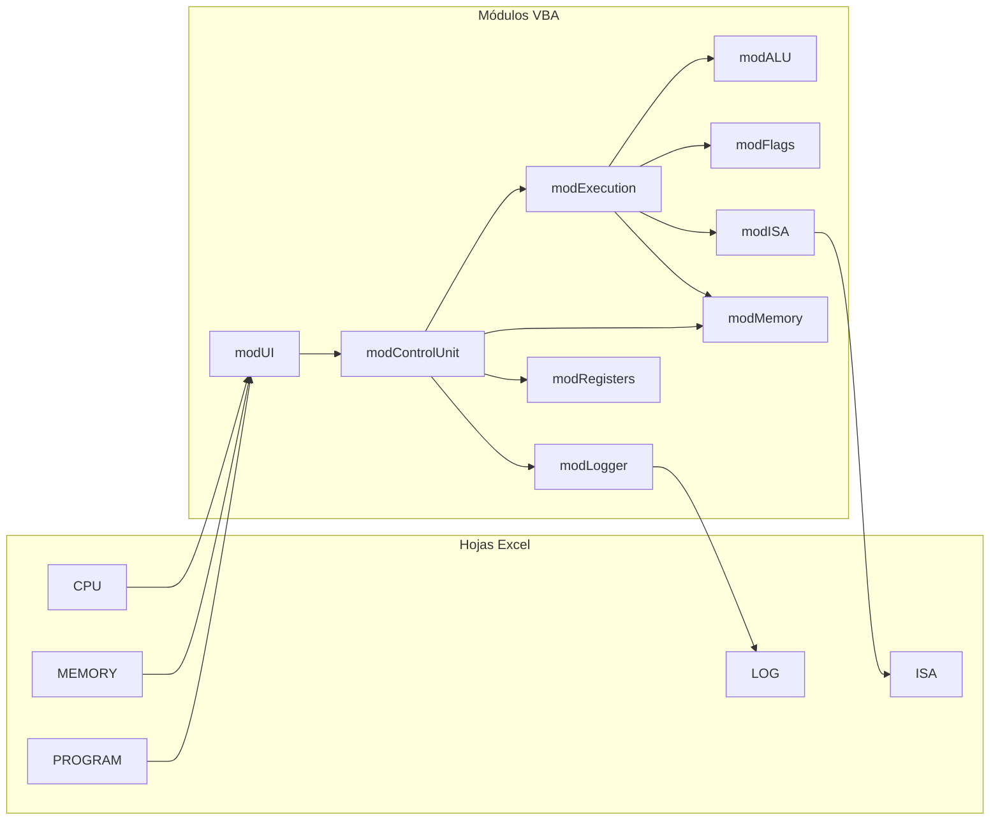
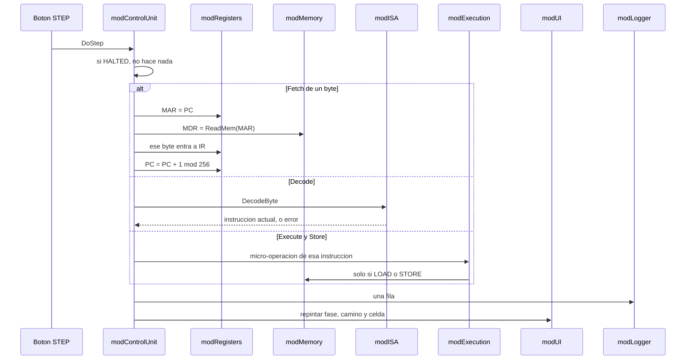

# Arquitectura general del simulador

CPU von Neumann / x86 de 8 bits y memoria principal, en Excel + VBA.  
Este documento fija **cómo está partido el sistema**: hojas, módulos y modelo de datos. El análisis de la consigna, la rúbrica y la codificación propuesta de la ISA están en [`ANALISIS.md`](ANALISIS.md). Aquí no se repite la nota: se define la forma para que el Parcial 2 pueda agregar bus, entrada/salida e interrupciones sin reescribir la ALU.

## Cómo usarlo

| Si vas a… | Lee |
|---|---|
| Saber qué dato existe y quién lo posee | [Modelo de datos](#1-modelo-de-datos) |
| Armar el `.xlsm` | [Hojas](#2-hojas-de-excel) |
| Escribir o buscar un procedimiento | [Módulos](#3-módulos-vba) |
| Seguir un clic de STEP | [Un paso del reloj](#4-un-paso-del-reloj) |
| Dejar hueco para el Parcial 2 | [Extensión](#5-hueco-para-el-parcial-2) |

El libro se llama `SimuladorCPU.xlsm` y vive en la raíz del repositorio. Cada módulo se exporta a `src/` con el mismo nombre, para que Git muestre el cambio de código y no solo el binario.

---

## 0. Vista de conjunto

Tres capas. La hoja no calcula la CPU: solo muestra el modelo. El modelo no pinta celdas: se lo pide a la interfaz.

Regla de dependencia, de abajo hacia arriba:

| Capa | Módulos | Puede llamar | No puede |
|---|---|---|---|
| Datos | `modMemory`, `modRegisters`, `modFlags`, `modISA` | Solo `modUtils` | Hojas, fase, botones |
| Operación | `modALU`, `modExecution` | Datos | Pintar celdas, decidir STEP/RUN |
| Control | `modControlUnit` | Operación y datos | Formato de Excel |
| Presentación | `modUI`, `modLogger` | Leer el modelo y escribir hojas | Calcular ADD ni mover el PC por su cuenta |

`modUtils` no aparece en el dibujo: comparaciones de byte, conversión hex/bin/dec y comprobación de rango. No guarda estado.

---

## 1. Modelo de datos

Todo valor de memoria o de registro es un entero **0…255**. Fuera de ese rango, la escritura se rechaza y el estado anterior no cambia. El mismo byte se lee sin signo (0…255) o en complemento a 2 (−128…127). El signo no se guarda aparte: es el bit 7.

### 1.1 RAM

Una sola memoria principal. No hay caché ni segmentos de hardware.

| Propiedad | Valor |
|---|---|
| Celdas | 256 |
| Direcciones | 00h … FFh |
| Ancho | 8 bits |
| Dueño | `modMemory` |
| Representación | `RAM(0 To 255) As Byte` |

Operaciones, y ninguna otra toca el arreglo:

| Operación | Efecto |
|---|---|
| `ReadMem(address) As Byte` | Devuelve `RAM(address)` si la dirección está en 0…255. Si no, error controlado. |
| `WriteMem(address, value)` | Escribe un byte ya validado. |
| `ClearMem()` | Pone las 256 celdas en 00h. No la llama RESET. |
| `LoadBlock(start, bytes())` | La usa LOAD PROGRAM para volcar el código desde 00h. |

Mapa lógico, solo visual y de convenio:

| Rango | Uso |
|---|---|
| 00h–7Fh | Código. LOAD PROGRAM escribe aquí y deja PC = 00h. |
| 80h–FFh | Datos del programa demostrativo. |

### 1.2 Registros

Dueño: `modRegisters`. Cada uno es `Byte`. La hoja solo los refleja.

| Registro | Papel | Quién lo escribe |
|---|---|---|
| PC | Dirección de la **siguiente** instrucción o del siguiente byte por traer | Fetch (PC+1 módulo 256) y los saltos en Execute |
| IR | Opcode y, si existe, el operando ya traído | Fetch |
| MAR | Dirección que sale hacia la RAM | Fetch, LOAD y STORE |
| MDR | Dato que acaba de entrar o que está por salir | Fetch, LOAD y STORE |
| AX | Acumulador | MOV, LOAD, ALU, NOT |
| BX | Propósito general | MOV, LOAD, ALU, NOT |

`ResetRegisters` pone los seis en 0. Asignar un valor mayor que 255 o menor que 0 no modifica el registro.

PC después de FFh vuelve a 00h. Ese módulo vive en `modRegisters`, no repartido por los saltos.

### 1.3 Flags

Dueño: `modFlags`. Tres bits, no un registro de 8.

| Flag | Vale 1 cuando |
|---|---|
| ZF | El resultado de la ALU es 00h |
| CF | ADD/INC: acarreo fuera del bit 7. SUB/DEC/CMP: préstamo sin signo |
| SF | El bit 7 del resultado es 1 |

`UpdateFlags(result, carry)` es la única escritura. La llama `modALU` al terminar una operación, incluida CMP. MOV, LOAD, STORE, JMP, JZ, JNZ y HLT no la llaman. AND, OR, XOR y NOT dejan CF en 0. INC y DEC sí actualizan CF: en este simulador son operaciones de la ALU.

`ResetFlags` pone las tres en 0.

### 1.4 Estado de la CPU

Dueño: `modControlUnit`. Enum `eCPUState`.

| Estado | Significado | STEP | RUN |
|---|---|---|---|
| `RUNNING` | El reloj puede avanzar | Avanza una micro-operación | Sigue hasta PAUSE o HLT |
| `PAUSED` | El bucle automático está detenido. Registros, RAM y fase siguen igual | Avanza una micro-operación | No corre hasta volver a RUN |
| `HALTED` | HLT o un error controlado | No avanza | No avanza |
| `RESET` | Transitorio. Al terminar, queda en `RUNNING` con fase FETCH | — | — |

RESET pone en cero PC, IR, MAR, MDR, AX, BX y las tres banderas, vacía el log, vuelve la fase a FETCH y el estado a `RUNNING`. **No borra la RAM.** Así se puede repetir el mismo programa.

### 1.5 Fase actual

Dueño: `modControlUnit`. Enum `ePhase`: `FETCH`, `DECODE`, `EXECUTE`, `STORE`.

No toda instrucción recorre las cuatro en un solo paso de reloj. Un clic de STEP ejecuta **una micro-operación**, y la fase visible es la de esa micro-operación. Una instrucción de 2 bytes hace Fetch dos veces (opcode y operando) antes de Decode.

La fase se guarda en una variable del módulo, no se deduce mirando colores de la hoja. `modUI` la lee para resaltar.

### 1.6 Instrucción actual

Dueño: `modExecution`, armada por `modISA` en Decode. No es un registro de la CPU: es el resultado de decodificar IR.

| Campo | Tipo | Ejemplo |
|---|---|---|
| `Opcode` | Byte | 10h |
| `Mnemonic` | String | `MOV` |
| `Dest` | AX, BX o ninguno | AX |
| `Source` | inmediato, registro o memoria | imm = 01h |
| `AddressMode` | `IMM`, `REG`, `DIRECT`, `NONE` | IMM |
| `Length` | 1 o 2 | 2 |
| `Operand` | Byte, si `Length` es 2 | 01h |
| `Text` | String para el panel y el log | `MOV AX, 01h` |

Si el opcode no está en la tabla, Decode no fabrica una instrucción: estado `HALTED`, fila de error en el log, registros intactos salvo lo que Fetch ya consumió.

La tabla (opcode, bytes, modo, texto) vive solo en `modISA` y se copia en la hoja ISA para la defensa. Execute no compara contra números sueltos: pregunta a la tabla.

---

## 2. Hojas de Excel

Seis hojas, con estos nombres exactos.

| Hoja | Para qué está | Qué no hace |
|---|---|---|
| CPU | Registros, banderas, fase, instrucción actual, botones | No es la RAM |
| MEMORY | Grilla 16×16, colores de zona, vista HEX / BIN / DEC-mnemónico | No ejecuta |
| PROGRAM | Una instrucción de ensamblador por fila | No es el código en RAM hasta LOAD PROGRAM |
| LOG | Un renglón por micro-operación | No se edita a mano durante la demo |
| ISA | Opcode, bytes, operandos, acción, mnemónico | Referencia visual de `modISA` |
| README | Cómo abrir el libro y usar los botones, dentro del archivo | El manual largo sigue en `README.md` del repo |

### 2.1 Hoja CPU

Bloques, de izquierda a derecha y de arriba abajo, para que en la defensa se señale sin buscar:

1. Estado (`eCPUState`) y fase (`ePhase`).
2. Camino de Fetch: PC, MAR, MDR, IR, con la flecha del paso activo.
3. Banco: AX y BX.
4. ALU: operación en curso y el resultado todavía no escrito, cuando el paso es Execute.
5. Banderas ZF, CF, SF.
6. Panel de la instrucción actual (`Text`) y el nombre de la micro-operación.
7. Botones: STEP, RUN, PAUSE, RESET, LOAD PROGRAM. Y una celda con el retardo de RUN, en milisegundos.

### 2.2 Hoja MEMORY

Grilla de 16 columnas por 16 filas. La fila `r` y la columna `c` son la dirección `r * 16 + c`.

Filas 0–7 (00h–7Fh) con el color de código. Filas 8–15 (80h–FFh) con el color de datos. Un control alterna la presentación HEX, BIN o DEC/mnemónico; el byte del modelo no cambia, solo el formato que pinta `modUI`.

La celda apuntada por MAR se resalta mientras el paso la está leyendo o escribiendo.

### 2.3 Nombres

El VBA no usa `Range("B12")`. Desde el primer layout existen estos nombres:

| Nombre | Contenido |
|---|---|
| `rngPC` `rngIR` `rngMAR` `rngMDR` `rngAX` `rngBX` | El byte visible de cada registro |
| `rngZF` `rngCF` `rngSF` | 0 o 1 |
| `rngState` `rngPhase` | Texto del estado y de la fase |
| `rngInstruccion` | Texto de la instrucción actual |
| `rngMicroOp` | Nombre del paso en curso |
| `rngRAM` | La grilla 16×16 |
| `rngDelay` | Retardo de RUN |
| `rngProgram` | Filas de la hoja PROGRAM |
| `rngLog` | Tabla de la hoja LOG |

---

## 3. Módulos VBA

Archivos esperados en `src/`:

`modMemory.bas`, `modRegisters.bas`, `modFlags.bas`, `modISA.bas`, `modALU.bas`, `modExecution.bas`, `modControlUnit.bas`, `modUI.bas`, `modLogger.bas`, `modUtils.bas`.

### 3.1 Datos

**modMemory.** Arreglo `RAM` y las cuatro operaciones de la sección 1.1. No sabe qué es un opcode.

**modRegisters.** Los seis `Byte`, `ResetRegisters` y el incremento de PC módulo 256. No decide si un salto se toma.

**modFlags.** ZF, CF, SF, `UpdateFlags`, `ResetFlags`. No sabe el nombre de la instrucción.

**modISA.** Constantes de opcode, `DecodeByte`, `MnemonicToOpcode` y el tamaño de cada instrucción. Decode y LOAD PROGRAM usan esta tabla y ninguna otra.

### 3.2 Operación

**modALU.** Funciones puras sobre bytes: ADD, SUB, INC, DEC, CMP, AND, OR, XOR, NOT. Cada una devuelve el byte resultado (CMP lo calcula y el llamador lo descarta) y llama a `UpdateFlags`. No escribe AX ni la RAM.

**modExecution.** Aplica la instrucción actual: elige la operación de la ALU o el salto, y hace el Store al registro o a memoria. LOAD y STORE pasan siempre por MAR y MDR. No avanza el reloj: el control le pide una micro-operación concreta.

### 3.3 Control

**modControlUnit.** Dueño del estado, de la fase y del puntero de micro-operación. Procedimientos públicos, que son los que enganchan los botones:

| Botón | Procedimiento | Hace |
|---|---|---|
| STEP | `DoStep` | Una micro-operación, si el estado no es `HALTED` |
| RUN | `DoRun` | Programa el siguiente `DoStep` tras `rngDelay`, sin congelar Excel |
| PAUSE | `DoPause` | Pasa a `PAUSED` y cancela el siguiente disparo |
| RESET | `DoReset` | Cero en CPU y banderas, fase FETCH, log vacío, RAM intacta |
| LOAD PROGRAM | `DoLoad` | Lee `rngProgram`, traduce con `modISA`, escribe en 00h, PC = 00h |

RUN no usa un `Do…Loop` cerrado. Un disparo, una micro-operación, y si el estado sigue en `RUNNING` se agenda el siguiente. PAUSE alcanza a cortar.

### 3.4 Presentación

**modUI.** Después de cada micro-operación lee el modelo y refresca las celdas con nombre, el resaltado de la fase, la flecha del camino de datos y la celda MAR. No contiene la suma ni el salto.

**modLogger.** Agrega una fila: paso, fase, micro-operación, PC, MAR, MDR, IR, AX, BX y las tres banderas. `ClearLog` solo lo llama RESET.

---

## 4. Un paso del reloj

`DoStep` no elige la operación aritmética. Avanza el cursor de micro-operaciones y delega.

Orden interno de Fetch, siempre en cuatro clics distintos: MAR ← PC, MDR ← RAM[MAR], IR ← MDR, PC ← PC+1. Una instrucción de dos bytes repite ese ciclo para el operando y recién entonces Decode.

Execute de una aritmética: la ALU calcula, las banderas cambian, y el Store del paso siguiente escribe AX o BX. CMP se detiene antes de esa escritura. STORE escribe con `WriteMem` usando MAR y MDR, no con una asignación directa al arreglo desde la hoja.

---

## 5. Hueco para el Parcial 2

El segundo parcial agrega bus multiplexado, controladores de entrada/salida, periféricos e interrupciones. Este parcial no los implementa. Para no cerrarles la puerta:

| Hoy | Mañana |
|---|---|
| `ReadMem` / `WriteMem` son el único acceso a los 256 bytes | El bus podrá interponerse delante de esas dos funciones sin que Execute conozca el cable |
| `modALU` no lee celdas | Un periférico no necesita duplicar la suma |
| El estado de la CPU es un enum en un solo módulo | Una interrupción podrá pasar a un estado nuevo sin buscar `If` sueltos en las hojas |
| La ISA es una tabla | Una instrucción nueva es una fila y un caso en Execute, que es lo que se ensaya en la defensa |
| Las hojas no guardan el modelo | Cambiar el dibujo no cambia el byte |

Queda fuera de estos módulos, a propósito: caché, pipeline y cualquier dirección de más de 8 bits.
